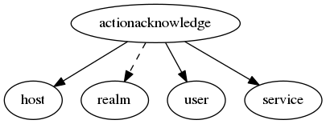

.. _resource-actionacknowledge:

Acknowledges (actionacknowledge)
================================

    The ``actionacknowledge`` contains the acknowledgement requested and processed.

    To acknowledge an host/service problem the client post on this endpoint to create a new
    acknowledge request that will be managed by the Alignak backend Broker module to build an
    external command notified to the Alignak framework.

    **Note** that the Alignak Web Services module allow to use more external commands.
    

.. csv-table:: Properties
   :header: "Property", "Type", "Required", "Default", "Relation"

   "| :ref:`_realm <actionacknowledge-_realm>`
   | *Realm*", "**objectid**", "**True**", "****", ":ref:`realm <resource-realm>`"
   "| :ref:`_sub_realm <actionacknowledge-_sub_realm>`
   | *Sub-realms*", "boolean", "", "False", ""
   "| _users_read", "objectid list", "", "", ":ref:`user <resource-user>`"
   "| :ref:`action <actionacknowledge-action>`
   | *Action*", "string", "", "add", ""
   "| :ref:`comment <actionacknowledge-comment>`
   | *Comment*", "string", "", "", ""
   "| :ref:`host <actionacknowledge-host>`
   | *Host*", "**objectid**", "**True**", "****", ":ref:`host <resource-host>`"
   "| :ref:`notified <actionacknowledge-notified>`
   | *Notified*", "boolean", "", "False", ""
   "| :ref:`notify <actionacknowledge-notify>`
   | *Notify*", "boolean", "", "False", ""
   "| :ref:`persistent <actionacknowledge-persistent>`
   | *Persistent*", "boolean", "", "True", ""
   "| :ref:`processed <actionacknowledge-processed>`
   | *Processed*", "boolean", "", "False", ""
   "| :ref:`service <actionacknowledge-service>`
   | *Service*", "**objectid**", "**True**", "****", ":ref:`service <resource-service>`"
   "| :ref:`sticky <actionacknowledge-sticky>`
   | *Sticky*", "boolean", "", "True", ""
   "| :ref:`user <actionacknowledge-user>`
   | *User*", "**objectid**", "**True**", "****", ":ref:`user <resource-user>`"
.. _actionacknowledge-_realm:

``_realm``: Realm this element belongs to. Note that this property will always be forced to the value of the concerned host realm.

.. _actionacknowledge-_sub_realm:

``_sub_realm``: Is this element visible in the sub-realms of its realm?

.. _actionacknowledge-action:

``action``: Use 'add' to add a new acknowledge, or 'delete' to delete an acknowledge

   Allowed values: add, delete

.. _actionacknowledge-comment:

``comment``: The comment of the acknowledge action. Free text.

.. _actionacknowledge-host:

``host``: The host concerned by the acknowledge.

.. _actionacknowledge-notified:

``notified``: The action has been fetched by the Alignak arbiter if notified is True but it is not yet to be considered as an effective scheduled downtime

.. _actionacknowledge-notify:

``notify``: If the notify option is set, a notification will be sent out to contacts indicating that the current host/service problem has been acknowledged, else there will be no notification.

.. _actionacknowledge-persistent:

``persistent``: Alignak always consider an acknowledge as persistent. Thus this property is of no importance and it will be removed in a future version.

.. _actionacknowledge-processed:

``processed``: The action has been set on the host/service by Alignak and it can be considered as effective if processed is True

.. _actionacknowledge-service:

``service``: The service concerned by the acknowledge.

.. _actionacknowledge-sticky:

``sticky``: If the sticky option is set, the acknowledgement will remain until the host/service recovers. Otherwise the acknowledgement will automatically be removed when the host/service state changes.

.. _actionacknowledge-user:

``user``: The user concerned by the acknowledge.

