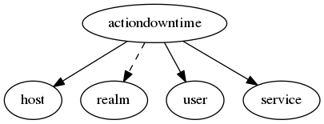

.. _resource-actiondowntime:

Downtimes (actiondowntime)
==========================

    The ``actiondowntime`` contains the downtimes requested and processed.

    To schedule a downtime for an host/service the client post on this endpoint to create a new
    downtime request that will be managed by the Alignak backend Broker module to build an
    external command notified to the Alignak framework.

    **Note** that the Alignak Web Services module allow to use more external commands.
    

.. csv-table:: Properties
   :header: "Property", "Type", "Required", "Default", "Relation"

   "| :ref:`_realm <actiondowntime-_realm>`
   | *Realm*", "objectid", "", "", ":ref:`realm <resource-realm>`"
   "| :ref:`_sub_realm <actiondowntime-_sub_realm>`
   | *Sub-realms*", "boolean", "", "True", ""
   "| _users_read", "objectid list", "", "", ":ref:`user <resource-user>`"
   "| :ref:`action <actiondowntime-action>`
   | *Action*", "string", "", "add", ""
   "| :ref:`comment <actiondowntime-comment>`
   | *Comment*", "string", "", "", ""
   "| :ref:`duration <actiondowntime-duration>`
   | *Duration*", "integer", "", "86400", ""
   "| :ref:`end_time <actiondowntime-end_time>`
   | *End time*", "integer", "", "86400", ""
   "| :ref:`fixed <actiondowntime-fixed>`
   | *Fixed*", "boolean", "", "True", ""
   "| :ref:`host <actiondowntime-host>`
   | *Host*", "**objectid**", "**True**", "****", ":ref:`host <resource-host>`"
   "| :ref:`notified <actiondowntime-notified>`
   | *Notified*", "boolean", "", "False", ""
   "| :ref:`processed <actiondowntime-processed>`
   | *Processed*", "boolean", "", "False", ""
   "| schema_version", "integer", "", "1", ""
   "| :ref:`service <actiondowntime-service>`
   | *Service*", "**objectid**", "**True**", "****", ":ref:`service <resource-service>`"
   "| :ref:`start_time <actiondowntime-start_time>`
   | *Start time*", "integer", "", "0", ""
   "| :ref:`user <actiondowntime-user>`
   | *User*", "**objectid**", "**True**", "****", ":ref:`user <resource-user>`"
.. _actiondowntime-_realm:

``_realm``: Realm this element belongs to. Note that this property will always be forced to the value of the concerned host realm.

.. _actiondowntime-_sub_realm:

``_sub_realm``: Is this element visible in the sub-realms of its realm?

.. _actiondowntime-action:

``action``: Use "add" to add a new downtime, or "delete" to delete an downtime

   Allowed values: [, ', a, d, d, ', ,,  , ', d, e, l, e, t, e, ', ]

.. _actiondowntime-comment:

``comment``: The comment of the downtime action. Free text.

.. _actiondowntime-duration:

``duration``: The ``duration`` property is used when the ``fixed`` property is not set.

.. _actiondowntime-end_time:

``end_time``: The ``start_time`` and ``end_time`` properties are specified in time_t format (seconds since the UNIX epoch).

.. _actiondowntime-fixed:

``fixed``: If the ``fixed`` argument is set, the downtime will start and end at the times specified by the ``start_time`` and ``end_time`` properties. Otherwise, the downtime will begin between the ``start_time`` and ``end_time`` times and will last for ``duration`` seconds.

.. _actiondowntime-host:

``host``: The host concerned by the downtime.

.. _actiondowntime-notified:

``notified``: The action has been fetched by the Alignak arbiter if notified is True but it is not yet to be considered as an effective scheduled downtime

.. _actiondowntime-processed:

``processed``: The action has been set on the host/service by Alignak and it can be considered as effective if processed is True

.. _actiondowntime-service:

``service``: The service concerned by the downtime.

.. _actiondowntime-start_time:

``start_time``: The ``start_time`` and ``end_time`` properties are specified in time_t format (seconds since the UNIX epoch).

.. _actiondowntime-user:

``user``: The user concerned by the downtime.

