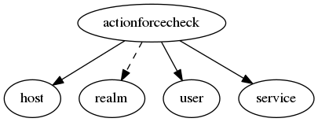

.. _resource-actionforcecheck:

Check request (actionforcecheck)
================================

    The ``actionforcecheck`` contains the checks requested and processed.

    To ask for a forced check for an host/service the client post on this endpoint to create a new
    re-check request that will be managed by the Alignak backend Broker module to build an
    external command notified to the Alignak framework.

    **Note** that the Alignak Web Services module allow to use more external commands.
    

.. csv-table:: Properties
   :header: "Property", "Type", "Required", "Default", "Relation"

   "| :ref:`_realm <actionforcecheck-_realm>`
   | *Realm*", "**objectid**", "**True**", "****", ":ref:`realm <resource-realm>`"
   "| :ref:`_sub_realm <actionforcecheck-_sub_realm>`
   | *Sub-realms*", "boolean", "", "False", ""
   "| _users_read", "objectid list", "", "", ":ref:`user <resource-user>`"
   "| :ref:`comment <actionforcecheck-comment>`
   | *Comment*", "string", "", "", ""
   "| :ref:`host <actionforcecheck-host>`
   | *Host*", "**objectid**", "**True**", "****", ":ref:`host <resource-host>`"
   "| :ref:`processed <actionforcecheck-processed>`
   | *Processed*", "boolean", "", "False", ""
   "| :ref:`service <actionforcecheck-service>`
   | *Service*", "**objectid**", "**True**", "****", ":ref:`service <resource-service>`"
   "| :ref:`user <actionforcecheck-user>`
   | *User*", "**objectid**", "**True**", "****", ":ref:`user <resource-user>`"
.. _actionforcecheck-_realm:

``_realm``: Realm this element belongs to. Note that this property will always be forced to the value of the concerned host realm.

.. _actionforcecheck-_sub_realm:

``_sub_realm``: Is this element visible in the sub-realms of its realm?

.. _actionforcecheck-comment:

``comment``: The comment of the acknowledge action. Free text.

.. _actionforcecheck-host:

``host``: The host concerned by the acknowledge.

.. _actionforcecheck-processed:

``processed``: The action has been set on the host/service by Alignak and it can be considered as effective if processed is True

.. _actionforcecheck-service:

``service``: The service concerned by the acknowledge.

.. _actionforcecheck-user:

``user``: The user concerned by the acknowledge.

