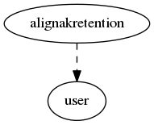

.. _resource-alignakretention:

Host/service data retention from scheduler of Alignak (alignakretention)
========================================================================

    The ``alignakretention`` model is used by the Alignak backend scheduler module for the
    Alignak retention feature.
    

.. csv-table:: Properties
   :header: "Property", "Type", "Required", "Default", "Relation"

   "| _user", "objectid", "", "", ":ref:`user <resource-user>`"
   "| host", "string", "", "", ""
   "| schema_version", "integer", "", "1", ""

