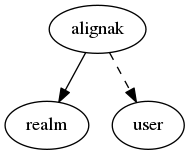

.. _resource-alignak:

alignak
=======

.. csv-table:: Properties
   :header: "Property", "Type", "Required", "Default", "Relation"

   "| _realm", "**objectid**", "**True**", "****", ":ref:`realm <resource-realm>`"
   "| _sub_realm", "boolean", "", "False", ""
   "| _users_delete", "objectid list", "", "", ":ref:`user <resource-user>`"
   "| _users_read", "objectid list", "", "", ":ref:`user <resource-user>`"
   "| _users_update", "objectid list", "", "", ":ref:`user <resource-user>`"
   "| alias", "string", "", "", ""
   "| name", "**string**", "**True**", "****", ""
   "| notes", "string", "", "", ""
   "| notes_url", "string", "", "", ""

