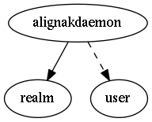

.. _resource-alignakdaemon:

alignakdaemon
===================

.. csv-table::
   :header: "Parameter", "Type", "Required", "Default", "Data relation"

   "_users_update", "list of objectid", "", "", ":ref:`user <resource-user>`"
   "**alive**", "**boolean**", "**True**", "**False**", ""
   "**last_check**", "**integer**", "**True**", "****", ""
   "**spare**", "**boolean**", "**True**", "**False**", ""
   "**address**", "**string**", "**True**", "****", ""
   "_users_read", "list of objectid", "", "", ":ref:`user <resource-user>`"
   "**port**", "**integer**", "**True**", "****", ""
   "**_realm**", "**objectid**", "**True**", "****", ":ref:`realm <resource-realm>`"
   "_users_delete", "list of objectid", "", "", ":ref:`user <resource-user>`"
   "**name**", "**string**", "**True**", "****", ""
   "**passive**", "**boolean**", "**True**", "**False**", ""
   "_sub_realm", "boolean", "", "False", ""
   "**reachable**", "**boolean**", "**True**", "**False**", ""
   "**type**", "**string**", "**True**", "****", ""

