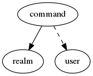

.. _resource-command:

command

===================

.. csv-table::
   :header: "Parameter", "Type", "Required", "Default", "Data relation"

   "_users_update", "list of objectid", "", "[]", ":ref:`user <resource-user>`"
   "**name**", "**string**", "**True**", "****", ""
   "definition_order", "integer", "", "100", ""
   "poller_tag", "string", "", "", ""
   "_sub_realm", "boolean", "", "True", ""
   "notes", "string", "", "", ""
   "command_line", "string", "", "", ""
   "_users_delete", "list of objectid", "", "[]", ":ref:`user <resource-user>`"
   "alias", "string", "", "", ""
   "reactionner_tag", "string", "", "", ""
   "module_type", "string", "", "fork", ""
   "**_realm**", "**objectid**", "**True**", "****", ":ref:`realm <resource-realm>`"
   "timeout", "integer", "", "-1", ""
   "_users_read", "list of objectid", "", "[]", ":ref:`user <resource-user>`"
   "enable_environment_macros", "boolean", "", "False", ""
   "imported_from", "string", "", "unknown", ""

