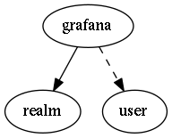

.. _resource-grafana:

grafana
===================

.. csv-table::
   :header: "Parameter", "Type", "Required", "Default", "Data relation"

   "_users_update", "list of objectid", "", "", ":ref:`user <resource-user>`"
   "**address**", "**string**", "**True**", "****", ""
   "timezone", "string", "", "browser", ""
   "_users_read", "list of objectid", "", "", ":ref:`user <resource-user>`"
   "port", "integer", "", "3000", ""
   "**_realm**", "**objectid**", "**True**", "****", ":ref:`realm <resource-realm>`"
   "**apikey**", "**string**", "**True**", "****", ""
   "**name**", "**string**", "**True**", "****", ""
   "refresh", "string", "", "1m", ""
   "_users_delete", "list of objectid", "", "", ":ref:`user <resource-user>`"
   "_sub_realm", "boolean", "", "False", ""

