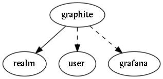

.. _resource-graphite:

graphite
===================

.. csv-table::
   :header: "Parameter", "Type", "Required", "Default", "Data relation"

   "carbon_port", "integer", "", "2004", ""
   "_users_update", "list of objectid", "", "", ":ref:`user <resource-user>`"
   "prefix", "string", "", "", ""
   "_users_read", "list of objectid", "", "", ":ref:`user <resource-user>`"
   "**_realm**", "**objectid**", "**True**", "****", ":ref:`realm <resource-realm>`"
   "**graphite_address**", "**string**", "**True**", "****", ""
   "**carbon_address**", "**string**", "**True**", "****", ""
   "**name**", "**string**", "**True**", "****", ""
   "graphite_port", "integer", "", "8080", ""
   "grafana", "objectid", "", "None", ":ref:`grafana <resource-grafana>`"
   "_users_delete", "list of objectid", "", "", ":ref:`user <resource-user>`"
   "_sub_realm", "boolean", "", "False", ""

