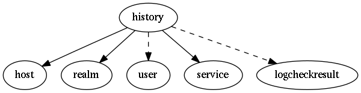

.. _resource-history:

history

===================

.. csv-table::
   :header: "Parameter", "Type", "Required", "Default", "Data relation"

   "_sub_realm", "boolean", "", "False", ""
   "**host**", "**objectid**", "**True**", "****", ":ref:`host <resource-host>`"
   "user", "objectid", "", "", ":ref:`user <resource-user>`"
   "**service**", "**objectid**", "**True**", "****", ":ref:`service <resource-service>`"
   "logcheckresult", "objectid", "", "", ":ref:`logcheckresult <resource-logcheckresult>`"
   "message", "string", "", "", ""
   "_users_read", "list of objectid", "", "", ":ref:`user <resource-user>`"
   "**type**", "**string**", "**True**", "**check.result**", ""
   "**_realm**", "**objectid**", "**True**", "****", ":ref:`realm <resource-realm>`"

