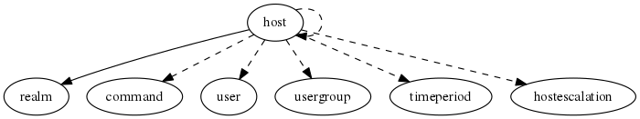

.. _resource-host:

Monitored host (host)
=====================

    The ``host`` model is used to represent a monitored host.

    An host may be a router, a server, a workstation, ... that you want to be monitored by your
    Alignak framework.
    

.. csv-table:: Properties
   :header: "Property", "Type", "Required", "Default", "Relation"

   "| :ref:`2d_coords <host-2d_coords>`", "string", "", "", ""
   "| :ref:`3d_coords <host-3d_coords>`", "string", "", "", ""
   "| :ref:`_is_template <host-_is_template>`
   | *Template*", "boolean", "", "False", ""
   "| :ref:`_overall_state_id <host-_overall_state_id>`
   | *Element overall state*", "integer", "", "3", ""
   "| :ref:`_realm <host-_realm>`
   | *Realm*", "**objectid**", "**True**", "****", ":ref:`realm <resource-realm>`"
   "| :ref:`_sub_realm <host-_sub_realm>`
   | *Sub-realms*", "boolean", "", "False", ""
   "| :ref:`_template_fields <host-_template_fields>`
   | *Template fields*", "dict", "", "{}", ""
   "| :ref:`_templates <host-_templates>`
   | *Templates*", "objectid list", "", "[]", ":ref:`host <resource-host>`"
   "| :ref:`_templates_with_services <host-_templates_with_services>`
   | *Template services*", "boolean", "", "True", ""
   "| _users_delete", "objectid list", "", "", ":ref:`user <resource-user>`"
   "| _users_read", "objectid list", "", "", ":ref:`user <resource-user>`"
   "| _users_update", "objectid list", "", "", ":ref:`user <resource-user>`"
   "| :ref:`action_url <host-action_url>`
   | *Actions URL*", "string", "", "", ""
   "| active_checks_enabled
   | *Active checks enabled*", "boolean", "", "True", ""
   "| address
   | *Host address (IPv4)*", "string", "", "", ""
   "| address6
   | *Host address (IPv6)*", "string", "", "", ""
   "| :ref:`alias <host-alias>`
   | *Alias*", "string", "", "", ""
   "| :ref:`business_impact <host-business_impact>`
   | *Business impact*", "integer", "", "2", ""
   "| :ref:`business_impact_modulations <host-business_impact_modulations>`
   | *Business impact modulations*", "list", "", "[]", ""
   "| :ref:`business_rule_downtime_as_ack <host-business_rule_downtime_as_ack>`
   | *BR downtime as ack*", "boolean", "", "False", ""
   "| :ref:`business_rule_host_notification_options <host-business_rule_host_notification_options>`
   | *BR host notification options*", "list", "", "['d', 'u', 'r', 'f', 's']", ""
   "| :ref:`business_rule_output_template <host-business_rule_output_template>`
   | *BR output template*", "string", "", "", ""
   "| :ref:`business_rule_service_notification_options <host-business_rule_service_notification_options>`
   | *BR service notification options*", "list", "", "['w', 'u', 'c', 'r', 'f', 's']", ""
   "| :ref:`business_rule_smart_notifications <host-business_rule_smart_notifications>`
   | *BR smart notifications*", "boolean", "", "False", ""
   "| :ref:`check_command <host-check_command>`
   | *Check command*", "objectid", "", "", ":ref:`command <resource-command>`"
   "| check_command_args
   | *Check command arguments*", "string", "", "", ""
   "| :ref:`check_freshness <host-check_freshness>`
   | *Check freshness*", "boolean", "", "False", ""
   "| :ref:`check_interval <host-check_interval>`
   | *Check interval*", "integer", "", "5", ""
   "| :ref:`check_period <host-check_period>`
   | *Check period*", "objectid", "", "", ":ref:`timeperiod <resource-timeperiod>`"
   "| :ref:`checkmodulations <host-checkmodulations>`
   | *Checks modulations*", "list", "", "[]", ""
   "| custom_views", "list", "", "[]", ""
   "| customs
   | *Custom variables*", "dict", "", "{}", ""
   "| :ref:`definition_order <host-definition_order>`
   | *Definition order*", "integer", "", "100", ""
   "| :ref:`display_name <host-display_name>`
   | *Display name*", "string", "", "", ""
   "| :ref:`escalations <host-escalations>`
   | *Escalations*", "objectid list", "", "[]", ":ref:`escalation <resource-escalation>`"
   "| :ref:`event_handler <host-event_handler>`
   | *Event handler*", "objectid", "", "None", ":ref:`command <resource-command>`"
   "| event_handler_args
   | *Event handler arguments*", "string", "", "", ""
   "| event_handler_enabled
   | *Event handler enabled*", "boolean", "", "False", ""
   "| :ref:`failure_prediction_enabled <host-failure_prediction_enabled>`
   | *Failure prediction*", "boolean", "", "False", ""
   "| :ref:`first_notification_delay <host-first_notification_delay>`
   | *First notification delay*", "integer", "", "0", ""
   "| :ref:`flap_detection_enabled <host-flap_detection_enabled>`
   | *Flapping detection enabled*", "boolean", "", "True", ""
   "| :ref:`flap_detection_options <host-flap_detection_options>`
   | *Flapping detection options*", "list", "", "['o', 'd', 'x']", ""
   "| :ref:`freshness_state <host-freshness_state>`
   | *Freshness state*", "string", "", "x", ""
   "| :ref:`freshness_threshold <host-freshness_threshold>`
   | *Freshness threshold*", "integer", "", "0", ""
   "| high_flap_threshold
   | *High flapping threshold*", "integer", "", "50", ""
   "| :ref:`icon_image <host-icon_image>`", "string", "", "", ""
   "| :ref:`icon_image_alt <host-icon_image_alt>`", "string", "", "", ""
   "| :ref:`icon_set <host-icon_set>`", "string", "", "", ""
   "| :ref:`imported_from <host-imported_from>`
   | *Imported from*", "string", "", "unknown", ""
   "| :ref:`initial_state <host-initial_state>`
   | *Initial state*", "string", "", "x", ""
   "| :ref:`labels <host-labels>`
   | *BR labels*", "list", "", "[]", ""
   "| :ref:`location <host-location>`
   | *Location*", "point", "", "{'type': 'Point', 'coordinates': [46.3613628, 6.5394704]}", ""
   "| low_flap_threshold
   | *Low flapping threshold*", "integer", "", "25", ""
   "| :ref:`ls_acknowledged <host-ls_acknowledged>`
   | *Acknowledged*", "boolean", "", "False", ""
   "| ls_acknowledgement_type
   | *Acknowledgement type*", "integer", "", "1", ""
   "| ls_attempt
   | *Current attempt number*", "integer", "", "0", ""
   "| ls_current_attempt
   | *Current attempt number*", "integer", "", "0", ""
   "| :ref:`ls_downtimed <host-ls_downtimed>`
   | *Downtimed*", "boolean", "", "False", ""
   "| :ref:`ls_execution_time <host-ls_execution_time>`
   | *Execution time*", "float", "", "0.0", ""
   "| :ref:`ls_grafana <host-ls_grafana>`
   | *Grafana available*", "boolean", "", "False", ""
   "| :ref:`ls_grafana_panelid <host-ls_grafana_panelid>`
   | *Grafana identifier*", "integer", "", "0", ""
   "| :ref:`ls_impact <host-ls_impact>`
   | *Impact*", "boolean", "", "False", ""
   "| :ref:`ls_last_check <host-ls_last_check>`
   | *Check timestamp*", "integer", "", "0", ""
   "| :ref:`ls_last_hard_state_changed <host-ls_last_hard_state_changed>`
   | *Last time hard state changed*", "integer", "", "0", ""
   "| ls_last_notification
   | *Last notification sent*", "integer", "", "0", ""
   "| :ref:`ls_last_state <host-ls_last_state>`
   | *Last state*", "string", "", "OK", ""
   "| :ref:`ls_last_state_changed <host-ls_last_state_changed>`
   | *Last state changed*", "integer", "", "0", ""
   "| :ref:`ls_last_state_type <host-ls_last_state_type>`
   | *Last state type*", "string", "", "HARD", ""
   "| :ref:`ls_last_time_down <host-ls_last_time_down>`
   | *Last time down*", "integer", "", "0", ""
   "| :ref:`ls_last_time_unknown <host-ls_last_time_unknown>`
   | *Last time unknown*", "integer", "", "0", ""
   "| :ref:`ls_last_time_unreachable <host-ls_last_time_unreachable>`
   | *Last time unreachable*", "integer", "", "0", ""
   "| :ref:`ls_last_time_up <host-ls_last_time_up>`
   | *Last time up*", "integer", "", "0", ""
   "| :ref:`ls_latency <host-ls_latency>`
   | *Latency*", "float", "", "0.0", ""
   "| :ref:`ls_long_output <host-ls_long_output>`
   | *Long output*", "string", "", "", ""
   "| ls_max_attempts
   | *Maximum attempts*", "integer", "", "0", ""
   "| :ref:`ls_next_check <host-ls_next_check>`
   | *Next check*", "integer", "", "0", ""
   "| :ref:`ls_output <host-ls_output>`
   | *Output*", "string", "", "", ""
   "| :ref:`ls_passive_check <host-ls_passive_check>`
   | *Check type*", "boolean", "", "False", ""
   "| :ref:`ls_perf_data <host-ls_perf_data>`
   | *Performance data*", "string", "", "", ""
   "| :ref:`ls_state <host-ls_state>`
   | *State*", "string", "", "UNREACHABLE", ""
   "| :ref:`ls_state_id <host-ls_state_id>`
   | *State identifier*", "integer", "", "3", ""
   "| :ref:`ls_state_type <host-ls_state_type>`
   | *State type*", "string", "", "HARD", ""
   "| :ref:`macromodulations <host-macromodulations>`
   | *Macros modulations*", "list", "", "[]", ""
   "| maintenance_period", "objectid", "", "", ":ref:`timeperiod <resource-timeperiod>`"
   "| :ref:`max_check_attempts <host-max_check_attempts>`
   | *Maximum check attempts*", "integer", "", "1", ""
   "| :ref:`name <host-name>`
   | *Host name*", "**string**", "**True**", "****", ""
   "| :ref:`notes <host-notes>`
   | *Notes*", "string", "", "", ""
   "| :ref:`notes_url <host-notes_url>`
   | *Notes URL*", "string", "", "", ""
   "| :ref:`notification_interval <host-notification_interval>`
   | *Notifications interval*", "integer", "", "60", ""
   "| :ref:`notification_options <host-notification_options>`
   | *Notifications options*", "list", "", "['d', 'x', 'r', 'f', 's']", ""
   "| :ref:`notification_period <host-notification_period>`
   | *Notifications period*", "objectid", "", "", ":ref:`timeperiod <resource-timeperiod>`"
   "| notifications_enabled
   | *Notifications enabled*", "boolean", "", "True", ""
   "| :ref:`obsess_over_host <host-obsess_over_host>`
   | *Obsessive check*", "boolean", "", "False", ""
   "| :ref:`parents <host-parents>`
   | *Parents*", "objectid list", "", "[]", ":ref:`host <resource-host>`"
   "| passive_checks_enabled
   | *Passive checks enabled*", "boolean", "", "True", ""
   "| :ref:`poller_tag <host-poller_tag>`
   | *Poller tag*", "string", "", "", ""
   "| process_perf_data
   | *Performance data enabled*", "boolean", "", "True", ""
   "| :ref:`reactionner_tag <host-reactionner_tag>`
   | *Reactionner tag*", "string", "", "", ""
   "| :ref:`resultmodulations <host-resultmodulations>`
   | *Results modulations*", "list", "", "[]", ""
   "| :ref:`retry_interval <host-retry_interval>`
   | *Retry interval*", "integer", "", "0", ""
   "| service_excludes", "list", "", "[]", ""
   "| service_includes", "list", "", "[]", ""
   "| service_overrides", "list", "", "[]", ""
   "| :ref:`snapshot_command <host-snapshot_command>`
   | *Snapshot command*", "objectid", "", "", ":ref:`command <resource-command>`"
   "| :ref:`snapshot_criteria <host-snapshot_criteria>`
   | *Snapshot criteria*", "list", "", "['d', 'x']", ""
   "| snapshot_enabled
   | *Snapshot enabled*", "boolean", "", "False", ""
   "| :ref:`snapshot_interval <host-snapshot_interval>`
   | *Snapshot interval*", "integer", "", "5", ""
   "| :ref:`snapshot_period <host-snapshot_period>`
   | *Snapshot period*", "objectid", "", "", ":ref:`timeperiod <resource-timeperiod>`"
   "| :ref:`stalking_options <host-stalking_options>`
   | *Stalking options*", "list", "", "[]", ""
   "| :ref:`statusmap_image <host-statusmap_image>`", "string", "", "", ""
   "| :ref:`tags <host-tags>`
   | *Tags*", "list", "", "[]", ""
   "| :ref:`time_to_orphanage <host-time_to_orphanage>`
   | *Time to orphanage*", "integer", "", "300", ""
   "| :ref:`trending_policies <host-trending_policies>`
   | *Trending policies*", "list", "", "[]", ""
   "| :ref:`trigger_broker_raise_enabled <host-trigger_broker_raise_enabled>`
   | *Trigger broker*", "boolean", "", "False", ""
   "| :ref:`trigger_name <host-trigger_name>`
   | *Trigger name*", "string", "", "", ""
   "| :ref:`usergroups <host-usergroups>`
   | *Notifications users*", "objectid list", "", "[]", ":ref:`usergroup <resource-usergroup>`"
   "| :ref:`users <host-users>`
   | *Notifications users*", "objectid list", "", "[]", ":ref:`user <resource-user>`"
   "| :ref:`vrml_image <host-vrml_image>`", "string", "", "", ""
.. _host-2d_coords:

``2d_coords``: Old Nagios stuff. To be deprecated

.. _host-3d_coords:

``3d_coords``: Old Nagios stuff. To be deprecated

.. _host-_is_template:

``_is_template``: Indicate if this element is a template or a real element

.. _host-_overall_state_id:

``_overall_state_id``: The overall state is a synthesis state that considers the element state, its acknowledgement, its downtime and its children states.

.. _host-_realm:

``_realm``: Realm this element belongs to.

.. _host-_sub_realm:

``_sub_realm``: Is this element visible in the sub-realms of its realm?

.. _host-_template_fields:

``_template_fields``: If this element is not a template, this field contains the list of the fields linked to the templates this element is linked to

.. _host-_templates:

``_templates``: List of templates this element is linked to.

.. _host-_templates_with_services:

``_templates_with_services``: If this element is a template, when a new element is created based upon this template, it will also inherit from the linked services templates of this template.

.. _host-action_url:

``action_url``: Element actions URL. Displayed in the Web UI as some available actions. Note that a very specific text format must be used for this field, see the Web UI documentation.

.. _host-alias:

``alias``: Element friendly name used by the Web User Interface.

.. _host-business_impact:

``business_impact``: The business impact level indicates the level of importance of this element. The highest value the most important is the elemen.

.. _host-business_impact_modulations:

``business_impact_modulations``: Not yet implemented (#116).

.. _host-business_rule_downtime_as_ack:

``business_rule_downtime_as_ack``: Not yet implemented (#146)

.. _host-business_rule_host_notification_options:

``business_rule_host_notification_options``: Not yet implemented (#146)

   Allowed values: d, u, r, f, s, n

.. _host-business_rule_output_template:

``business_rule_output_template``: Not yet implemented (#146)

.. _host-business_rule_service_notification_options:

``business_rule_service_notification_options``: Not yet implemented (#146)

   Allowed values: w, u, c, r, f, s, n

.. _host-business_rule_smart_notifications:

``business_rule_smart_notifications``: Not yet implemented (#146)

.. _host-check_command:

``check_command``: Command that will be executed to check if the element is ok.

.. _host-check_freshness:

``check_freshness``: Passive checks only. If the freshness check is enabled, and no passive check has been received since freshness_threshold seconds, the state will be forced to freshness_state.

.. _host-check_interval:

``check_interval``: Active checks only. Number of minutes between the periodical checks.

.. _host-check_period:

``check_period``: Time period during which active / passive checks can be made.

.. _host-checkmodulations:

``checkmodulations``: Not yet implemented (#114).

.. _host-definition_order:

``definition_order``: Priority level if several elements have the same name

.. _host-display_name:

``display_name``: Old Nagios stuff. To be deprecated

.. _host-escalations:

``escalations``: List of the escalations applied to this element. Not yet implemented.

.. _host-event_handler:

``event_handler``: Command that should run whenever a change in the element state is detected.

.. _host-failure_prediction_enabled:

``failure_prediction_enabled``: Nagios legacy property not used in Alignak

.. _host-first_notification_delay:

``first_notification_delay``: Number of minutes to wait before sending out the first problem notification when a non-ok state is detected. If you set this value to 0, the first notification will be sent-out immediately.

.. _host-flap_detection_enabled:

``flap_detection_enabled``: Flapping occurs when an element changes state too frequently, resulting in a storm of problem and recovery notifications. Once an element is detected as flapping, all its notifications are blocked.

.. _host-flap_detection_options:

``flap_detection_options``: States involved in the flapping detection logic.

   Allowed values: o, d, x

.. _host-freshness_state:

``freshness_state``: Passive checks only. The state that will be forced by Alignak when the freshness check fails.

   Allowed values: o, d, x

.. _host-freshness_threshold:

``freshness_threshold``: Passive checks only. Number of seconds for the freshness check to force the freshness_state. If this value is set to 0, Alignak will use a default value (3600 seconds)

.. _host-icon_image:

``icon_image``: Old Nagios stuff. To be deprecated

.. _host-icon_image_alt:

``icon_image_alt``: Old Nagios stuff. To be deprecated

.. _host-icon_set:

``icon_set``: Old Nagios stuff. To be deprecated

.. _host-imported_from:

``imported_from``: Item importation source (alignak-backend-import, ...)

.. _host-initial_state:

``initial_state``: Alignak sets this default state until a check happen

   Allowed values: o, d, x

.. _host-labels:

``labels``: Not yet implemented (#146)

.. _host-location:

``location``: Element GPS coordinates

.. _host-ls_acknowledged:

``ls_acknowledged``: Currently acknowledged

.. _host-ls_downtimed:

``ls_downtimed``: Currently downtimed

.. _host-ls_execution_time:

``ls_execution_time``: Last check execution time

.. _host-ls_grafana:

``ls_grafana``: This element has a Grafana panel available

.. _host-ls_grafana_panelid:

``ls_grafana_panelid``: Grafana panel identifier

.. _host-ls_impact:

``ls_impact``: Is an impact?

.. _host-ls_last_check:

``ls_last_check``: Last check timestamp

.. _host-ls_last_hard_state_changed:

``ls_last_hard_state_changed``: Last time this element hard state has changed.

.. _host-ls_last_state:

``ls_last_state``: Former state

   Allowed values: OK, WARNING, CRITICAL, UNKNOWN, UP, DOWN, UNREACHABLE

.. _host-ls_last_state_changed:

``ls_last_state_changed``: Last state changed timestamp

.. _host-ls_last_state_type:

``ls_last_state_type``: Former state type

   Allowed values: HARD, SOFT

.. _host-ls_last_time_down:

``ls_last_time_down``: Last time this element was Down.

.. _host-ls_last_time_unknown:

``ls_last_time_unknown``: Last time this element was Unknown.

.. _host-ls_last_time_unreachable:

``ls_last_time_unreachable``: Last time this element was Unreachable.

.. _host-ls_last_time_up:

``ls_last_time_up``: Last time this element was Up.

.. _host-ls_latency:

``ls_latency``: Last check latency

.. _host-ls_long_output:

``ls_long_output``: Last check long output

.. _host-ls_next_check:

``ls_next_check``: Next check timestamp

.. _host-ls_output:

``ls_output``: Last check output

.. _host-ls_passive_check:

``ls_passive_check``: Last check was active or passive?

.. _host-ls_perf_data:

``ls_perf_data``: Last check performance data

.. _host-ls_state:

``ls_state``: Current state

   Allowed values: UP, DOWN, UNREACHABLE

.. _host-ls_state_id:

``ls_state_id``: Current state identifier. O: UP, 1: DOWN, 2: UNREACHABLE

.. _host-ls_state_type:

``ls_state_type``: Current state type

   Allowed values: HARD, SOFT

.. _host-macromodulations:

``macromodulations``: Not yet implemented (#115).

.. _host-max_check_attempts:

``max_check_attempts``: Active checks only. Number of times the check command will be executed if it returns a state other than Ok. Setting this value to 1 will raise an alert without any retry.

.. _host-name:

``name``: Unique host name

.. _host-notes:

``notes``: Element notes. Free text to store element information.

.. _host-notes_url:

``notes_url``: Element notes URL. Displayed in the Web UI as some URL to be navigatesd. Note that a very specific text format must be used for this field, see the Web UI documentation.

.. _host-notification_interval:

``notification_interval``: Number of minutes to wait before re-sending the notifications if the problem is still present. If you set this value to 0, only one notification will be sent out.

.. _host-notification_options:

``notification_options``: List of the notifications types that can be sent.

   Allowed values: d, x, r, f, s, n

.. _host-notification_period:

``notification_period``: Time period during which notifications can be sent.

.. _host-obsess_over_host:

``obsess_over_host``: Nagios legacy property not used in Alignak

.. _host-parents:

``parents``: Elements which this element depends of. Used to define the network hierarchy.

.. _host-poller_tag:

``poller_tag``: Set a value for this element checks to be managed by a dedicated poller.

.. _host-reactionner_tag:

``reactionner_tag``: Set a value for this element notifications to be managed by a dedicated reactionner.

.. _host-resultmodulations:

``resultmodulations``: Not yet implemented (#116).

.. _host-retry_interval:

``retry_interval``: Active checks only. Number of minutes to wait before scheduling a re-check. Checks are rescheduled at the retry interval when they have changed to a non-ok state. Once it has been retried max_check_attempts times without a change in its status, it will revert to being scheduled at its check_interval period.

.. _host-snapshot_command:

``snapshot_command``: Command executed for the snapshot

.. _host-snapshot_criteria:

``snapshot_criteria``: Execute the snapshot command when the state matches one of the criteria

.. _host-snapshot_interval:

``snapshot_interval``: Minimum interval between two snapshots

.. _host-snapshot_period:

``snapshot_period``: Time period when the snapshot feature is active

.. _host-stalking_options:

``stalking_options``: When enabled for a specific state, Alignak will add an information log for each element check even if the state did not changed.

   Allowed values: o, d, x

.. _host-statusmap_image:

``statusmap_image``: Old Nagios stuff. To be deprecated

.. _host-tags:

``tags``: List of tags for this element. Currently, only the used templates appear in the tags list. Will be improved feature...

.. _host-time_to_orphanage:

``time_to_orphanage``: To be clearly understood and documented...

.. _host-trending_policies:

``trending_policies``: To be explained (see #113)

.. _host-trigger_broker_raise_enabled:

``trigger_broker_raise_enabled``: To be documented

.. _host-trigger_name:

``trigger_name``: To be documented

.. _host-usergroups:

``usergroups``: List of the users groups that will receive the sent notifications.

.. _host-users:

``users``: List of the users that will receive the sent notifications.

.. _host-vrml_image:

``vrml_image``: Old Nagios stuff. To be deprecated

