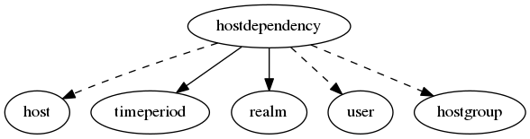

.. _resource-hostdependency:

Host dependency (hostdependency)
================================

    The ``hostdependency`` model is used to define dependency relations and tests conditions.

    See the Alignak documentation regarding the dependency check management.
    

.. csv-table:: Properties
   :header: "Property", "Type", "Required", "Default", "Relation"

   "| :ref:`_realm <hostdependency-_realm>`
   | *Realm*", "**objectid**", "**True**", "****", ":ref:`realm <resource-realm>`"
   "| :ref:`_sub_realm <hostdependency-_sub_realm>`
   | *Sub-realms*", "boolean", "", "False", ""
   "| _users_delete", "objectid list", "", "", ":ref:`user <resource-user>`"
   "| _users_read", "objectid list", "", "", ":ref:`user <resource-user>`"
   "| _users_update", "objectid list", "", "", ":ref:`user <resource-user>`"
   "| :ref:`alias <hostdependency-alias>`
   | *Alias*", "string", "", "", ""
   "| :ref:`definition_order <hostdependency-definition_order>`
   | *Definition order*", "integer", "", "100", ""
   "| :ref:`dependency_period <hostdependency-dependency_period>`
   | *Dependency period*", "**objectid**", "**True**", "****", ":ref:`timeperiod <resource-timeperiod>`"
   "| :ref:`dependent_hostgroups <hostdependency-dependent_hostgroups>`
   | *Dependent hosts groups*", "objectid list", "", "", ":ref:`hostgroup <resource-hostgroup>`"
   "| :ref:`dependent_hosts <hostdependency-dependent_hosts>`
   | *Dependent hosts*", "objectid list", "", "", ":ref:`host <resource-host>`"
   "| :ref:`execution_failure_criteria <hostdependency-execution_failure_criteria>`
   | *Execution criteria*", "list", "", "['n']", ""
   "| :ref:`hostgroups <hostdependency-hostgroups>`
   | *Hosts groups*", "objectid list", "", "", ":ref:`hostgroup <resource-hostgroup>`"
   "| :ref:`hosts <hostdependency-hosts>`
   | *Hosts*", "objectid list", "", "", ":ref:`host <resource-host>`"
   "| :ref:`imported_from <hostdependency-imported_from>`
   | *Imported from*", "string", "", "unknown", ""
   "| :ref:`inherits_parent <hostdependency-inherits_parent>`
   | *Parent inheritance*", "boolean", "", "False", ""
   "| name
   | *Host dependency name*", "string", "", "", ""
   "| :ref:`notes <hostdependency-notes>`
   | *Notes*", "string", "", "", ""
   "| :ref:`notification_failure_criteria <hostdependency-notification_failure_criteria>`
   | *Notification criteria*", "list", "", "['d', 'u', 'p']", ""
.. _hostdependency-_realm:

``_realm``: Realm this element belongs to.

.. _hostdependency-_sub_realm:

``_sub_realm``: Is this element visible in the sub-realms of its realm?

.. _hostdependency-alias:

``alias``: Element friendly name used by the Web User Interface.

.. _hostdependency-definition_order:

``definition_order``: Priority level if several elements have the same name

.. _hostdependency-dependency_period:

``dependency_period``: Time period during which the dependency checks are done.

.. _hostdependency-dependent_hostgroups:

``dependent_hostgroups``: List of the hosts groups that are depending.

.. _hostdependency-dependent_hosts:

``dependent_hosts``: List of the hosts that are depending.

.. _hostdependency-execution_failure_criteria:

``execution_failure_criteria``: See Alginak doc about dependency checks.

   Allowed values: o, d, x, p, n

.. _hostdependency-hostgroups:

``hostgroups``: List of the hosts groups involved in the dependency.

.. _hostdependency-hosts:

``hosts``: List of the hosts involved in the dependency.

.. _hostdependency-imported_from:

``imported_from``: Item importation source (alignak-backend-import, ...)

.. _hostdependency-inherits_parent:

``inherits_parent``: See Alginak doc about dependency checks.

.. _hostdependency-notes:

``notes``: Element notes. Free text to store element information.

.. _hostdependency-notification_failure_criteria:

``notification_failure_criteria``: See Alginak doc about dependency checks.

   Allowed values: o, d, x, p, n

