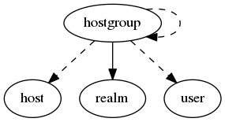

.. _resource-hostgroup:

Alignak hosts groups (hostgroup)
================================

    The ``hostgroup`` model is used to group several hosts.

    

.. csv-table:: Properties
   :header: "Property", "Type", "Required", "Default", "Relation"

   "| :ref:`_level <hostgroup-_level>`
   | *Level*", "integer", "", "0", ""
   "| :ref:`_parent <hostgroup-_parent>`
   | *Parent*", "objectid", "", "None", ":ref:`hostgroup <resource-hostgroup>`"
   "| :ref:`_realm <hostgroup-_realm>`
   | *Realm*", "**objectid**", "**True**", "****", ":ref:`realm <resource-realm>`"
   "| :ref:`_sub_realm <hostgroup-_sub_realm>`
   | *Sub-realms*", "boolean", "", "True", ""
   "| :ref:`_tree_parents <hostgroup-_tree_parents>`
   | *Parents*", "objectid list", "", "[]", ":ref:`hostgroup <resource-hostgroup>`"
   "| _users_delete", "objectid list", "", "", ":ref:`user <resource-user>`"
   "| _users_read", "objectid list", "", "", ":ref:`user <resource-user>`"
   "| _users_update", "objectid list", "", "", ":ref:`user <resource-user>`"
   "| :ref:`action_url <hostgroup-action_url>`
   | *Actions URL*", "string", "", "", ""
   "| :ref:`alias <hostgroup-alias>`
   | *Alias*", "string", "", "", ""
   "| :ref:`definition_order <hostgroup-definition_order>`
   | *Definition order*", "integer", "", "100", ""
   "| :ref:`hostgroups <hostgroup-hostgroups>`
   | *Groups*", "objectid list", "", "[]", ":ref:`hostgroup <resource-hostgroup>`"
   "| :ref:`hosts <hostgroup-hosts>`
   | *Members*", "objectid list", "", "[]", ":ref:`host <resource-host>`"
   "| :ref:`imported_from <hostgroup-imported_from>`
   | *Imported from*", "string", "", "unknown", ""
   "| :ref:`name <hostgroup-name>`
   | *Hosts group name*", "**string**", "**True**", "****", ""
   "| :ref:`notes <hostgroup-notes>`
   | *Notes*", "string", "", "", ""
   "| :ref:`notes_url <hostgroup-notes_url>`
   | *Notes URL*", "string", "", "", ""
   "| schema_version", "integer", "", "1", ""
.. _hostgroup-_level:

``_level``: Level in the hierarchy

.. _hostgroup-_parent:

``_parent``: Immediate parent in the hierarchy

.. _hostgroup-_realm:

``_realm``: Realm this element belongs to.

.. _hostgroup-_sub_realm:

``_sub_realm``: Is this element visible in the sub-realms of its realm?

.. _hostgroup-_tree_parents:

``_tree_parents``: List of parents in the hierarchy

.. _hostgroup-action_url:

``action_url``: Element actions URL. Displayed in the Web UI as some available actions. Note that a very specific text format must be used for this field, see the Web UI documentation.

.. _hostgroup-alias:

``alias``: Element friendly name used by the Web User Interface.

.. _hostgroup-definition_order:

``definition_order``: Priority level if several elements have the same name

.. _hostgroup-hostgroups:

``hostgroups``: List of the groups of this group

.. _hostgroup-hosts:

``hosts``: List of the members of this group

.. _hostgroup-imported_from:

``imported_from``: Item importation source (alignak-backend-import, ...)

.. _hostgroup-name:

``name``: Unique hosts group name

.. _hostgroup-notes:

``notes``: Element notes. Free text to store element information.

.. _hostgroup-notes_url:

``notes_url``: Element notes URL. Displayed in the Web UI as some URL to be navigatesd. Note that a very specific text format must be used for this field, see the Web UI documentation.

