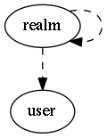

.. _resource-realm:

realm

===================

.. csv-table::
   :header: "Parameter", "Type", "Required", "Default", "Data relation"

   "_all_children", "list of objectid", "", "[]", ":ref:`realm <resource-realm>`"
   "_level", "integer", "", "", ""
   "_users_update", "list of objectid", "", "", ":ref:`user <resource-user>`"
   "_users_read", "list of objectid", "", "", ":ref:`user <resource-user>`"
   "global_warning_threshold", "integer", "", "3", ""
   "**name**", "**string**", "**True**", "****", ""
   "definition_order", "integer", "", "100", ""
   "_children", "list of objectid", "", "[]", ":ref:`realm <resource-realm>`"
   "default", "boolean", "", "False", ""
   "notes", "string", "", "", ""
   "hosts_critical_threshold", "integer", "", "5", ""
   "_users_delete", "list of objectid", "", "", ":ref:`user <resource-user>`"
   "hosts_warning_threshold", "integer", "", "3", ""
   "_parent", "objectid", "", "", ":ref:`realm <resource-realm>`"
   "alias", "string", "", "", ""
   "services_warning_threshold", "integer", "", "3", ""
   "global_critical_threshold", "integer", "", "5", ""
   "_tree_parents", "list of objectid", "", "[]", ":ref:`realm <resource-realm>`"
   "services_critical_threshold", "integer", "", "5", ""
   "imported_from", "string", "", "unknown", ""

