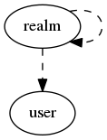

.. _resource-realm:

Alignak realm (realm)
=====================

    The ``realm`` model is used to represent a realm of the monitored system.

    The Alignak framework distributed architecture allows to have a unique Alignak instance to
    manage a huge system. I nsuch a cas, it is interesting to be able to cut this huge
    configuration into parts for different sites, customers, ... For Alignak, those parts are
    **realms**.

    A realm is a group of resources (hosts ) tha users will be able to manage. All resources in
    the Alignak backend are attached to a realm. At minimum, it is the *All* realm that always
    exist in any Alignak instance.

    The realm organization is hierarchical. A realm may have sub-realms that also may have
    sub-realms. Sub-realms visibility of the resources allow the Alignak backend users to view
    the resources defined in upper realms.
    

.. csv-table:: Properties
   :header: "Property", "Type", "Required", "Default", "Relation"

   "| :ref:`_all_children <realm-_all_children>`
   | *Children*", "objectid list", "", "[]", ":ref:`realm <resource-realm>`"
   "| :ref:`_children <realm-_children>`
   | *Children*", "objectid list", "", "[]", ":ref:`realm <resource-realm>`"
   "| :ref:`_level <realm-_level>`
   | *Level*", "integer", "", "0", ""
   "| :ref:`_parent <realm-_parent>`
   | *Parent*", "objectid", "", "None", ":ref:`realm <resource-realm>`"
   "| :ref:`_tree_parents <realm-_tree_parents>`
   | *Parents*", "objectid list", "", "[]", ":ref:`realm <resource-realm>`"
   "| _users_delete", "objectid list", "", "", ":ref:`user <resource-user>`"
   "| _users_read", "objectid list", "", "", ":ref:`user <resource-user>`"
   "| _users_update", "objectid list", "", "", ":ref:`user <resource-user>`"
   "| :ref:`alias <realm-alias>`
   | *Alias*", "string", "", "", ""
   "| :ref:`default <realm-default>`
   | *Default realm*", "boolean", "", "False", ""
   "| :ref:`definition_order <realm-definition_order>`
   | *Definition order*", "integer", "", "100", ""
   "| global_critical_threshold", "integer", "", "5", ""
   "| global_warning_threshold", "integer", "", "3", ""
   "| hosts_critical_threshold", "integer", "", "5", ""
   "| hosts_warning_threshold", "integer", "", "3", ""
   "| :ref:`imported_from <realm-imported_from>`
   | *Imported from*", "string", "", "unknown", ""
   "| :ref:`name <realm-name>`
   | *Realm name*", "**string**", "**True**", "****", ""
   "| :ref:`notes <realm-notes>`
   | *Notes*", "string", "", "", ""
   "| schema_version", "integer", "", "1", ""
   "| services_critical_threshold", "integer", "", "5", ""
   "| services_warning_threshold", "integer", "", "3", ""
.. _realm-_all_children:

``_all_children``: List of all the children in the hierarchy

.. _realm-_children:

``_children``: List of the immediate children in the hierarchy

.. _realm-_level:

``_level``: Level in the hierarchy

.. _realm-_parent:

``_parent``: Immediate parent in the hierarchy

.. _realm-_tree_parents:

``_tree_parents``: List of parents in the hierarchy

.. _realm-alias:

``alias``: Element friendly name used by the Web User Interface.

.. _realm-default:

``default``: This realm is the default realm used when no realm information is provided.

.. _realm-definition_order:

``definition_order``: Priority level if several elements have the same name

.. _realm-imported_from:

``imported_from``: Item importation source (alignak-backend-import, ...)

.. _realm-name:

``name``: Unique realm name

.. _realm-notes:

``notes``: Element notes. Free text to store element information.

