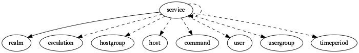

.. _resource-service:

service

===================

.. csv-table::
   :header: "Parameter", "Type", "Required", "Default", "Data relation"

   "ls_grafana", "boolean", "", "False", ""
   "business_impact_modulations", "list", "", "[]", ""
   "labels", "list", "", "[]", ""
   "obsess_over_service", "boolean", "", "False", ""
   "action_url", "string", "", "", ""
   "low_flap_threshold", "integer", "", "-1", ""
   "process_perf_data", "boolean", "", "True", ""
   "icon_image", "string", "", "", ""
   "**_realm**", "**objectid**", "**True**", "****", ":ref:`realm <resource-realm>`"
   "_users_delete", "list of objectid", "", "", ":ref:`user <resource-user>`"
   "passive_checks_enabled", "boolean", "", "True", ""
   "display_name", "string", "", "", ""
   "notification_interval", "integer", "", "60", ""
   "ls_execution_time", "float", "", "0.0", ""
   "failure_prediction_enabled", "boolean", "", "False", ""
   "retry_interval", "integer", "", "0", ""
   "snapshot_enabled", "boolean", "", "False", ""
   "event_handler_enabled", "boolean", "", "False", ""
   "ls_acknowledged", "boolean", "", "False", ""
   "_template_fields", "dict", "", "{}", ""
   "snapshot_period", "objectid", "", "", ":ref:`timeperiod <resource-timeperiod>`"
   "notifications_enabled", "boolean", "", "True", ""
   "aggregation", "string", "", "", ""
   "freshness_threshold", "integer", "", "0", ""
   "time_to_orphanage", "integer", "", "300", ""
   "**name**", "**string**", "**True**", "****", ""
   "notes", "string", "", "", ""
   "parallelize_check", "boolean", "", "True", ""
   "merge_host_users", "boolean", "", "False", ""
   "custom_views", "list", "", "[]", ""
   "_users_update", "list of objectid", "", "", ":ref:`user <resource-user>`"
   "active_checks_enabled", "boolean", "", "True", ""
   "host_dependency_enabled", "boolean", "", "True", ""
   "ls_max_attempts", "integer", "", "0", ""
   "hostgroups", "list of objectid", "", "[]", ":ref:`hostgroup <resource-hostgroup>`"
   "reactionner_tag", "string", "", "", ""
   "is_volatile", "boolean", "", "False", ""
   "ls_last_state", "string", "", "OK", ""
   "default_value", "string", "", "", ""
   "usergroups", "list of objectid", "", "[]", ":ref:`usergroup <resource-usergroup>`"
   "notification_period", "objectid", "", "", ":ref:`timeperiod <resource-timeperiod>`"
   "resultmodulations", "list", "", "[]", ""
   "business_rule_downtime_as_ack", "boolean", "", "False", ""
   "stalking_options", "list", "", "[]", ""
   "_sub_realm", "boolean", "", "False", ""
   "ls_long_output", "string", "", "", ""
   "macromodulations", "list", "", "[]", ""
   "ls_state_id", "integer", "", "3", ""
   "business_rule_host_notification_options", "list", "", "[]", ""
   "ls_impact", "boolean", "", "False", ""
   "_is_template", "boolean", "", "False", ""
   "definition_order", "integer", "", "100", ""
   "tags", "list", "", "[]", ""
   "snapshot_criteria", "list", "", "['w', 'c', 'u']", ""
   "host", "objectid", "", "", ":ref:`host <resource-host>`"
   "ls_latency", "float", "", "0.0", ""
   "ls_downtimed", "boolean", "", "False", ""
   "ls_current_attempt", "integer", "", "0", ""
   "ls_grafana_panelid", "integer", "", "0", ""
   "icon_set", "string", "", "", ""
   "business_impact", "integer", "", "2", ""
   "max_check_attempts", "integer", "", "1", ""
   "business_rule_service_notification_options", "list", "", "[]", ""
   "escalations", "list of objectid", "", "[]", ":ref:`escalation <resource-escalation>`"
   "ls_next_check", "integer", "", "0", ""
   "check_period", "objectid", "", "", ":ref:`timeperiod <resource-timeperiod>`"
   "flap_detection_options", "list", "", "['o', 'w', 'c', 'u']", ""
   "ls_last_check", "integer", "", "0", ""
   "trigger", "string", "", "", ""
   "initial_state", "string", "", "u", ""
   "first_notification_delay", "integer", "", "0", ""
   "_templates", "list of objectid", "", "[]", ":ref:`service <resource-service>`"
   "notification_options", "list", "", "['w', 'u', 'c', 'r', 'f', 's']", ""
   "event_handler", "objectid", "", "", ":ref:`command <resource-command>`"
   "check_command_args", "string", "", "", ""
   "ls_last_state_changed", "integer", "", "0", ""
   "imported_from", "string", "", "unknown", ""
   "trigger_broker_raise_enabled", "boolean", "", "False", ""
   "ls_state", "string", "", "UNKNOWN", ""
   "check_command", "objectid", "", "", ":ref:`command <resource-command>`"
   "high_flap_threshold", "integer", "", "-1", ""
   "check_interval", "integer", "", "5", ""
   "notes_url", "string", "", "", ""
   "check_freshness", "boolean", "", "False", ""
   "snapshot_interval", "integer", "", "5", ""
   "icon_image_alt", "string", "", "", ""
   "_templates_from_host_template", "boolean", "", "False", ""
   "checkmodulations", "list", "", "[]", ""
   "ls_output", "string", "", "", ""
   "_users_read", "list of objectid", "", "", ":ref:`user <resource-user>`"
   "ls_last_state_type", "string", "", "HARD", ""
   "maintenance_period", "objectid", "", "", ":ref:`timeperiod <resource-timeperiod>`"
   "ls_perf_data", "string", "", "", ""
   "alias", "string", "", "", ""
   "freshness_state", "string", "", "o", ""
   "trending_policies", "list", "", "[]", ""
   "flap_detection_enabled", "boolean", "", "True", ""
   "users", "list of objectid", "", "[]", ":ref:`user <resource-user>`"
   "business_rule_smart_notifications", "boolean", "", "False", ""
   "customs", "dict", "", "{}", ""
   "service_dependencies", "list of objectid", "", "[]", ":ref:`service <resource-service>`"
   "snapshot_command", "objectid", "", "", ":ref:`command <resource-command>`"
   "duplicate_foreach", "string", "", "", ""
   "poller_tag", "string", "", "", ""
   "ls_state_type", "string", "", "HARD", ""
   "business_rule_output_template", "string", "", "", ""

