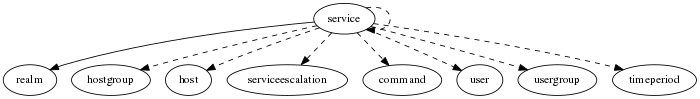

.. _resource-service:

Monitored service (service)
===========================

    The ``service`` model is used to represent a monitored service.

    A service is a monitored feature attached to an host.and monitored by your
    Alignak framework.
    

.. csv-table:: Properties
   :header: "Property", "Type", "Required", "Default", "Relation"

   "| :ref:`_is_template <service-_is_template>`
   | *Template*", "boolean", "", "False", ""
   "| :ref:`_overall_state_id <service-_overall_state_id>`
   | *Element overall state*", "integer", "", "3", ""
   "| :ref:`_realm <service-_realm>`
   | *Realm*", "**objectid**", "**True**", "****", ":ref:`realm <resource-realm>`"
   "| :ref:`_sub_realm <service-_sub_realm>`
   | *Sub-realms*", "boolean", "", "True", ""
   "| :ref:`_template_fields <service-_template_fields>`
   | *Template fields*", "list", "", "[]", ""
   "| :ref:`_templates <service-_templates>`
   | *Templates*", "objectid list", "", "[]", ":ref:`service <resource-service>`"
   "| :ref:`_templates_from_host_template <service-_templates_from_host_template>`
   | *Template from host*", "boolean", "", "False", ""
   "| _users_delete", "objectid list", "", "", ":ref:`user <resource-user>`"
   "| _users_read", "objectid list", "", "", ":ref:`user <resource-user>`"
   "| _users_update", "objectid list", "", "", ":ref:`user <resource-user>`"
   "| :ref:`action_url <service-action_url>`
   | *Actions URL*", "string", "", "", ""
   "| active_checks_enabled
   | *Active checks enabled*", "boolean", "", "True", ""
   "| :ref:`aggregation <service-aggregation>`
   | *Aggregation*", "string", "", "", ""
   "| :ref:`alias <service-alias>`
   | *Alias*", "string", "", "", ""
   "| :ref:`business_impact <service-business_impact>`
   | *Business impact*", "integer", "", "2", ""
   "| :ref:`business_impact_modulations <service-business_impact_modulations>`
   | *Business impact modulations*", "list", "", "[]", ""
   "| :ref:`business_rule_downtime_as_ack <service-business_rule_downtime_as_ack>`
   | *BR downtime as ack*", "boolean", "", "False", ""
   "| :ref:`business_rule_host_notification_options <service-business_rule_host_notification_options>`
   | *BR host notification options*", "list", "", "['d', 'u', 'r', 'f', 's']", ""
   "| :ref:`business_rule_output_template <service-business_rule_output_template>`
   | *BR output template*", "string", "", "", ""
   "| :ref:`business_rule_service_notification_options <service-business_rule_service_notification_options>`
   | *BR service notification options*", "list", "", "['w', 'u', 'c', 'r', 'f', 's']", ""
   "| :ref:`business_rule_smart_notifications <service-business_rule_smart_notifications>`
   | *BR smart notifications*", "boolean", "", "False", ""
   "| :ref:`check_command <service-check_command>`
   | *Check command*", "objectid", "", "", ":ref:`command <resource-command>`"
   "| :ref:`check_command_args <service-check_command_args>`
   | *Check command arguments*", "string", "", "", ""
   "| :ref:`check_freshness <service-check_freshness>`
   | *Check freshness*", "boolean", "", "False", ""
   "| :ref:`check_interval <service-check_interval>`
   | *Check interval*", "integer", "", "5", ""
   "| :ref:`check_period <service-check_period>`
   | *Check period*", "objectid", "", "", ":ref:`timeperiod <resource-timeperiod>`"
   "| :ref:`checkmodulations <service-checkmodulations>`
   | *Checks modulations*", "list", "", "[]", ""
   "| custom_views", "list", "", "[]", ""
   "| customs
   | *Custom variables*", "dict", "", "{}", ""
   "| default_value", "string", "", "", ""
   "| :ref:`definition_order <service-definition_order>`
   | *Definition order*", "integer", "", "100", ""
   "| :ref:`display_name <service-display_name>`
   | *Display name*", "string", "", "", ""
   "| :ref:`duplicate_foreach <service-duplicate_foreach>`
   | *Duplicate for each*", "string", "", "", ""
   "| :ref:`escalations <service-escalations>`
   | *Escalations*", "objectid list", "", "[]", ":ref:`serviceescalation <resource-serviceescalation>`"
   "| :ref:`event_handler <service-event_handler>`
   | *Event handler*", "objectid", "", "None", ":ref:`command <resource-command>`"
   "| event_handler_args
   | *Event handler arguments*", "string", "", "", ""
   "| event_handler_enabled
   | *Event handler enabled*", "boolean", "", "False", ""
   "| :ref:`first_notification_delay <service-first_notification_delay>`
   | *First notification delay*", "integer", "", "0", ""
   "| :ref:`flap_detection_enabled <service-flap_detection_enabled>`
   | *Flapping detection enabled*", "boolean", "", "True", ""
   "| :ref:`flap_detection_options <service-flap_detection_options>`
   | *Flapping detection options*", "list", "", "['o', 'w', 'c', 'u', 'x']", ""
   "| :ref:`freshness_state <service-freshness_state>`
   | *Freshness state*", "string", "", "x", ""
   "| :ref:`freshness_threshold <service-freshness_threshold>`
   | *Freshness threshold*", "integer", "", "0", ""
   "| high_flap_threshold
   | *High flapping threshold*", "integer", "", "50", ""
   "| :ref:`host <service-host>`
   | *Linked host*", "objectid", "", "", ":ref:`host <resource-host>`"
   "| :ref:`host_dependency_enabled <service-host_dependency_enabled>`
   | *Aggregation*", "boolean", "", "True", ""
   "| hostgroups", "objectid list", "", "[]", ":ref:`hostgroup <resource-hostgroup>`"
   "| :ref:`icon_image <service-icon_image>`", "string", "", "", ""
   "| :ref:`icon_image_alt <service-icon_image_alt>`", "string", "", "", ""
   "| :ref:`icon_set <service-icon_set>`", "string", "", "", ""
   "| :ref:`imported_from <service-imported_from>`
   | *Imported from*", "string", "", "unknown", ""
   "| :ref:`initial_state <service-initial_state>`
   | *Initial state*", "string", "", "x", ""
   "| :ref:`is_volatile <service-is_volatile>`
   | *Volatile*", "boolean", "", "False", ""
   "| :ref:`labels <service-labels>`
   | *BR labels*", "list", "", "[]", ""
   "| low_flap_threshold
   | *Low flapping threshold*", "integer", "", "25", ""
   "| :ref:`ls_acknowledged <service-ls_acknowledged>`
   | *Acknowledged*", "boolean", "", "False", ""
   "| ls_acknowledgement_type
   | *Acknowledgement type*", "integer", "", "1", ""
   "| ls_current_attempt
   | *Current attempt number*", "integer", "", "0", ""
   "| :ref:`ls_downtimed <service-ls_downtimed>`
   | *Downtimed*", "boolean", "", "False", ""
   "| :ref:`ls_execution_time <service-ls_execution_time>`
   | *Execution time*", "float", "", "0.0", ""
   "| :ref:`ls_grafana <service-ls_grafana>`
   | *Grafana available*", "boolean", "", "False", ""
   "| :ref:`ls_grafana_panelid <service-ls_grafana_panelid>`
   | *Grafana identifier*", "integer", "", "0", ""
   "| :ref:`ls_last_check <service-ls_last_check>`
   | *Last check time*", "integer", "", "0", ""
   "| :ref:`ls_last_hard_state_changed <service-ls_last_hard_state_changed>`
   | *Last time hard state changed*", "integer", "", "0", ""
   "| ls_last_notification
   | *Last notification sent*", "integer", "", "0", ""
   "| :ref:`ls_last_state <service-ls_last_state>`
   | *Last state*", "string", "", "UNKNOWN", ""
   "| :ref:`ls_last_state_changed <service-ls_last_state_changed>`
   | *Last state changed*", "integer", "", "0", ""
   "| :ref:`ls_last_state_type <service-ls_last_state_type>`
   | *Last state type*", "string", "", "HARD", ""
   "| :ref:`ls_last_time_critical <service-ls_last_time_critical>`
   | *Last time critical*", "integer", "", "0", ""
   "| :ref:`ls_last_time_ok <service-ls_last_time_ok>`
   | *Last time ok*", "integer", "", "0", ""
   "| :ref:`ls_last_time_unknown <service-ls_last_time_unknown>`
   | *Last time unknown*", "integer", "", "0", ""
   "| :ref:`ls_last_time_unreachable <service-ls_last_time_unreachable>`
   | *Last time unreachable*", "integer", "", "0", ""
   "| :ref:`ls_last_time_warning <service-ls_last_time_warning>`
   | *Last time warning*", "integer", "", "0", ""
   "| :ref:`ls_latency <service-ls_latency>`
   | *Latency*", "float", "", "0.0", ""
   "| :ref:`ls_long_output <service-ls_long_output>`
   | *Long output*", "string", "", "", ""
   "| :ref:`ls_next_check <service-ls_next_check>`
   | *Next check*", "integer", "", "0", ""
   "| :ref:`ls_output <service-ls_output>`
   | *Output*", "string", "", "", ""
   "| :ref:`ls_passive_check <service-ls_passive_check>`
   | *Check type*", "boolean", "", "False", ""
   "| :ref:`ls_perf_data <service-ls_perf_data>`
   | *Performance data*", "string", "", "", ""
   "| :ref:`ls_state <service-ls_state>`
   | *State*", "string", "", "UNKNOWN", ""
   "| :ref:`ls_state_changed <service-ls_state_changed>`
   | *Last time state changed*", "integer", "", "0", ""
   "| :ref:`ls_state_id <service-ls_state_id>`
   | *State identifier*", "integer", "", "3", ""
   "| :ref:`ls_state_type <service-ls_state_type>`
   | *State type*", "string", "", "HARD", ""
   "| :ref:`macromodulations <service-macromodulations>`
   | *Macros modulations*", "list", "", "[]", ""
   "| :ref:`maintenance_period <service-maintenance_period>`
   | *Maintenance period*", "objectid", "", "", ":ref:`timeperiod <resource-timeperiod>`"
   "| :ref:`max_check_attempts <service-max_check_attempts>`
   | *Maximum check attempts*", "integer", "", "1", ""
   "| merge_host_users", "boolean", "", "False", ""
   "| :ref:`name <service-name>`
   | *Service name*", "**string**", "**True**", "****", ""
   "| :ref:`notes <service-notes>`
   | *Notes*", "string", "", "", ""
   "| :ref:`notes_url <service-notes_url>`
   | *Notes URL*", "string", "", "", ""
   "| :ref:`notification_interval <service-notification_interval>`
   | *Notifications interval*", "integer", "", "60", ""
   "| :ref:`notification_options <service-notification_options>`
   | *Notifications options*", "list", "", "['w', 'u', 'c', 'r', 'f', 's', 'x']", ""
   "| :ref:`notification_period <service-notification_period>`
   | *Notifications period*", "objectid", "", "", ":ref:`timeperiod <resource-timeperiod>`"
   "| notifications_enabled
   | *Notifications enabled*", "boolean", "", "True", ""
   "| parallelize_check", "boolean", "", "True", ""
   "| passive_checks_enabled
   | *Passive checks enabled*", "boolean", "", "True", ""
   "| :ref:`poller_tag <service-poller_tag>`
   | *Poller tag*", "string", "", "", ""
   "| process_perf_data
   | *Performance data enabled*", "boolean", "", "True", ""
   "| :ref:`reactionner_tag <service-reactionner_tag>`
   | *Reactionner tag*", "string", "", "", ""
   "| :ref:`resultmodulations <service-resultmodulations>`
   | *Results modulations*", "list", "", "[]", ""
   "| :ref:`retry_interval <service-retry_interval>`
   | *Retry interval*", "integer", "", "0", ""
   "| schema_version", "integer", "", "3", ""
   "| :ref:`service_dependencies <service-service_dependencies>`
   | *Dependencies*", "objectid list", "", "[]", ":ref:`service <resource-service>`"
   "| :ref:`snapshot_command <service-snapshot_command>`
   | *Snapshot command*", "objectid", "", "", ":ref:`command <resource-command>`"
   "| :ref:`snapshot_criteria <service-snapshot_criteria>`
   | *Snapshot criteria*", "list", "", "['w', 'c', 'x']", ""
   "| snapshot_enabled
   | *Snapshot enabled*", "boolean", "", "False", ""
   "| :ref:`snapshot_interval <service-snapshot_interval>`
   | *Snapshot interval*", "integer", "", "5", ""
   "| :ref:`snapshot_period <service-snapshot_period>`
   | *Snapshot period*", "objectid", "", "", ":ref:`timeperiod <resource-timeperiod>`"
   "| :ref:`stalking_options <service-stalking_options>`
   | *Stalking options*", "list", "", "[]", ""
   "| :ref:`tags <service-tags>`
   | *Tags*", "list", "", "[]", ""
   "| :ref:`time_to_orphanage <service-time_to_orphanage>`
   | *Time to orphanage*", "integer", "", "300", ""
   "| :ref:`trending_policies <service-trending_policies>`
   | *Trending policies*", "list", "", "[]", ""
   "| :ref:`trigger_broker_raise_enabled <service-trigger_broker_raise_enabled>`
   | *Trigger broker*", "boolean", "", "False", ""
   "| :ref:`trigger_name <service-trigger_name>`
   | *Trigger name*", "string", "", "", ""
   "| :ref:`usergroups <service-usergroups>`
   | *Notifications users groups*", "objectid list", "", "[]", ":ref:`usergroup <resource-usergroup>`"
   "| :ref:`users <service-users>`
   | *Notifications users*", "objectid list", "", "[]", ":ref:`user <resource-user>`"
.. _service-_is_template:

``_is_template``: Indicate if this element is a template or a real element

.. _service-_overall_state_id:

``_overall_state_id``: The overall state is a synthesis state that considers the element state, its acknowledgement and its downtime.

.. _service-_realm:

``_realm``: Realm this element belongs to.

.. _service-_sub_realm:

``_sub_realm``: Is this element visible in the sub-realms of its realm?

.. _service-_template_fields:

``_template_fields``: If this element is not a template, this field contains the list of the fields linked to the templates this element is linked to

.. _service-_templates:

``_templates``: List of templates this element is linked to.

.. _service-_templates_from_host_template:

``_templates_from_host_template``: This element was created as a service from an host template.

.. _service-action_url:

``action_url``: Element actions URL. Displayed in the Web UI as some available actions. Note that a very specific text format must be used for this field, see the Web UI documentation.

.. _service-aggregation:

``aggregation``: Group the services is belonging to. Used for the Web UI tree view.

.. _service-alias:

``alias``: Element friendly name used by the Web User Interface.

.. _service-business_impact:

``business_impact``: The business impact level indicates the level of importance of this element. The highest value the most important is the element.

   Allowed values: [, 0, ,,  , 1, ,,  , 2, ,,  , 3, ,,  , 4, ,,  , 5, ]

.. _service-business_impact_modulations:

``business_impact_modulations``: Not yet implemented (#116).

.. _service-business_rule_downtime_as_ack:

``business_rule_downtime_as_ack``: Not yet implemented (#146)

.. _service-business_rule_host_notification_options:

``business_rule_host_notification_options``: Not yet implemented (#146)

   Allowed values: [, ', d, ', ,,  , ', u, ', ,,  , ', r, ', ,,  , ', f, ', ,,  , ', s, ', ,,  , ', n, ', ]

.. _service-business_rule_output_template:

``business_rule_output_template``: Not yet implemented (#146)

.. _service-business_rule_service_notification_options:

``business_rule_service_notification_options``: Not yet implemented (#146)

   Allowed values: [, ', w, ', ,,  , ', u, ', ,,  , ', c, ', ,,  , ', r, ', ,,  , ', f, ', ,,  , ', s, ', ,,  , ', n, ', ]

.. _service-business_rule_smart_notifications:

``business_rule_smart_notifications``: Not yet implemented (#146)

.. _service-check_command:

``check_command``: Command that will be executed to check if the element is ok.

.. _service-check_command_args:

``check_command_args``: Separate arguments with !. For example, if your have 2 arguments, enter test1!test2

.. _service-check_freshness:

``check_freshness``: Passive checks only. If the freshness check is enabled, and no passive check has been received since freshness_threshold seconds, the state will be forced to freshness_state.

.. _service-check_interval:

``check_interval``: Active checks only. Number of minutes between the periodical checks.

.. _service-check_period:

``check_period``: Time period during which active / passive checks can be made.

.. _service-checkmodulations:

``checkmodulations``: Not yet implemented (#114).

.. _service-definition_order:

``definition_order``: Priority level if several elements have the same name

.. _service-display_name:

``display_name``: Old Nagios stuff. To be deprecated

.. _service-duplicate_foreach:

``duplicate_foreach``: To be deprecated. Shinken stuff...

.. _service-escalations:

``escalations``: List of the escalations applied to this element. Not yet implemented.

.. _service-event_handler:

``event_handler``: Command that should run whenever a change in the element state is detected.

.. _service-first_notification_delay:

``first_notification_delay``: Number of minutes to wait before sending out the first problem notification when a non-ok state is detected. If you set this value to 0, the first notification will be sent-out immediately.

.. _service-flap_detection_enabled:

``flap_detection_enabled``: Flapping occurs when an element changes state too frequently, resulting in a storm of problem and recovery notifications. Once an element is detected as flapping, all its notifications are blocked.

.. _service-flap_detection_options:

``flap_detection_options``: States involved in the flapping detection logic.

   Allowed values: [, ', o, ', ,,  , ', w, ', ,,  , ', c, ', ,,  , ', u, ', ,,  , ', x, ', ]

.. _service-freshness_state:

``freshness_state``: Passive checks only. The state that will be forced by Alignak when the freshness check fails.

   Allowed values: [, ', o, ', ,,  , ', w, ', ,,  , ', c, ', ,,  , ', u, ', ,,  , ', x, ', ]

.. _service-freshness_threshold:

``freshness_threshold``: Passive checks only. Number of seconds for the freshness check to force the freshness_state. If this value is set to 0, Alignak will use a default value (3600 seconds)

.. _service-host:

``host``: Host the service is linked to

.. _service-host_dependency_enabled:

``host_dependency_enabled``: Unset this to remove the dependency between this service and its parent host. Used for volatile services that need notification related to itself and not depend on the host notifications.

.. _service-icon_image:

``icon_image``: Old Nagios stuff. To be deprecated

.. _service-icon_image_alt:

``icon_image_alt``: Old Nagios stuff. To be deprecated

.. _service-icon_set:

``icon_set``: Old Nagios stuff. To be deprecated

.. _service-imported_from:

``imported_from``: Item importation source (alignak-backend-import, ...)

.. _service-initial_state:

``initial_state``: Alignak sets this default state until a check happen

   Allowed values: [, ', o, ', ,,  , ', w, ', ,,  , ', c, ', ,,  , ', u, ', ,,  , ', x, ', ]

.. _service-is_volatile:

``is_volatile``: To make it simple, volatile services ignore the hard state transition and they always notify when they are in a non ok state. For more information, read the Alignak documentation about this type of services.

.. _service-labels:

``labels``: Not yet implemented (#146)

.. _service-ls_acknowledged:

``ls_acknowledged``: Currently acknowledged

.. _service-ls_downtimed:

``ls_downtimed``: Currently downtimed

.. _service-ls_execution_time:

``ls_execution_time``: Last check execution time

.. _service-ls_grafana:

``ls_grafana``: This element has a Grafana panel available

.. _service-ls_grafana_panelid:

``ls_grafana_panelid``: Grafana panel identifier

.. _service-ls_last_check:

``ls_last_check``: Last check timestamp

.. _service-ls_last_hard_state_changed:

``ls_last_hard_state_changed``: Last time this element hard state has changed.

.. _service-ls_last_state:

``ls_last_state``: Former state

   Allowed values: [, ', O, K, ', ,,  , ', W, A, R, N, I, N, G, ', ,,  , ', C, R, I, T, I, C, A, L, ', ,,  , ', U, N, K, N, O, W, N, ', ,,  , ', U, N, R, E, A, C, H, A, B, L, E, ', ]

.. _service-ls_last_state_changed:

``ls_last_state_changed``: Last state changed timestamp

.. _service-ls_last_state_type:

``ls_last_state_type``: Former state type

   Allowed values: [, ', H, A, R, D, ', ,,  , ', S, O, F, T, ', ]

.. _service-ls_last_time_critical:

``ls_last_time_critical``: Last time this element was Unknown.

.. _service-ls_last_time_ok:

``ls_last_time_ok``: Last time this element was Ok.

.. _service-ls_last_time_unknown:

``ls_last_time_unknown``: Last time this element was Unknown.

.. _service-ls_last_time_unreachable:

``ls_last_time_unreachable``: Last time this element was Unreachable.

.. _service-ls_last_time_warning:

``ls_last_time_warning``: Last time this element was Warning.

.. _service-ls_latency:

``ls_latency``: Last check latency

.. _service-ls_long_output:

``ls_long_output``: Last check long output

.. _service-ls_next_check:

``ls_next_check``: Next check timestamp

.. _service-ls_output:

``ls_output``: Last check output

.. _service-ls_passive_check:

``ls_passive_check``: Last check was active or passive?

.. _service-ls_perf_data:

``ls_perf_data``: Last check performance data

.. _service-ls_state:

``ls_state``: Current state

   Allowed values: [, ', O, K, ', ,,  , ', W, A, R, N, I, N, G, ', ,,  , ', C, R, I, T, I, C, A, L, ', ,,  , ', U, N, K, N, O, W, N, ', ,,  , ', U, N, R, E, A, C, H, A, B, L, E, ', ]

.. _service-ls_state_changed:

``ls_state_changed``: Last time this element state has changed.

.. _service-ls_state_id:

``ls_state_id``: Current state identifier. O: OK, 1: WARNING, 2: CRITICAL, 3: UNKNOWN, 4: UNREACHABLE

   Allowed values: [, 0, ,,  , 1, ,,  , 2, ,,  , 3, ,,  , 4, ]

.. _service-ls_state_type:

``ls_state_type``: Current state type

   Allowed values: [, ', H, A, R, D, ', ,,  , ', S, O, F, T, ', ]

.. _service-macromodulations:

``macromodulations``: Not yet implemented (#115).

.. _service-maintenance_period:

``maintenance_period``: The maintenance period of a service is a time period that defines an equivalent of scheduled downtimes for the service.

.. _service-max_check_attempts:

``max_check_attempts``: Active checks only. Number of times the check command will be executed if it returns a state other than Ok. Setting this value to 1 will raise an alert without any retry.

.. _service-name:

``name``: Service name (eg. service_description)

.. _service-notes:

``notes``: Element notes. Free text to store element information.

.. _service-notes_url:

``notes_url``: Element notes URL. Displayed in the Web UI as some URL to be navigatesd. Note that a very specific text format must be used for this field, see the Web UI documentation.

.. _service-notification_interval:

``notification_interval``: Number of minutes to wait before re-sending the notifications if the problem is still present. If you set this value to 0, only one notification will be sent out.

.. _service-notification_options:

``notification_options``: List of the notifications types that can be sent.

   Allowed values: [, ', w, ', ,,  , ', u, ', ,,  , ', c, ', ,,  , ', r, ', ,,  , ', f, ', ,,  , ', s, ', ,,  , ', x, ', ,,  , ', n, ', ]

.. _service-notification_period:

``notification_period``: Time period during which notifications can be sent.

.. _service-poller_tag:

``poller_tag``: Set a value for this element checks to be managed by a dedicated poller.

.. _service-reactionner_tag:

``reactionner_tag``: Set a value for this element notifications to be managed by a dedicated reactionner.

.. _service-resultmodulations:

``resultmodulations``: Not yet implemented (#116).

.. _service-retry_interval:

``retry_interval``: Active checks only. Number of minutes to wait before scheduling a re-check. Checks are rescheduled at the retry interval when they have changed to a non-ok state. Once it has been retried max_check_attempts times without a change in its status, it will revert to being scheduled at its check_interval period.

.. _service-service_dependencies:

``service_dependencies``: List of the services that this service is dependent of for notifications. A default service_dependency will exist with default values (notification_failure_criteria as "u,c,w" and no dependency_period). 

.. _service-snapshot_command:

``snapshot_command``: Command executed for the snapshot

.. _service-snapshot_criteria:

``snapshot_criteria``: Execute the snapshot command when the state matches one of the criteria

.. _service-snapshot_interval:

``snapshot_interval``: Minimum interval between two snapshots

.. _service-snapshot_period:

``snapshot_period``: Time period when the snapshot feature is active

.. _service-stalking_options:

``stalking_options``: When enabled for a specific state, Alignak will add an information log for each element check even if the state did not changed.

   Allowed values: [, ', o, ', ,,  , ', w, ', ,,  , ', u, ', ,,  , ', c, ', ,,  , ', x, ', ]

.. _service-tags:

``tags``: List of tags for this element. Intended to set tags by the Web UI

.. _service-time_to_orphanage:

``time_to_orphanage``: To be clearly understood and documented...

.. _service-trending_policies:

``trending_policies``: To be explained (see #113)

.. _service-trigger_broker_raise_enabled:

``trigger_broker_raise_enabled``: To be documented

.. _service-trigger_name:

``trigger_name``: To be documented

.. _service-usergroups:

``usergroups``: List of the users groups that will receive the sent notifications.

.. _service-users:

``users``: List of the users that will receive the sent notifications.

