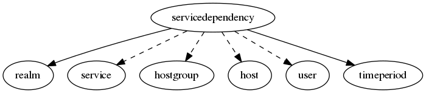

.. _resource-servicedependency:

Service dependency (servicedependency)
======================================

    The ``servicedependency`` model is used to define dependency relations and tests conditions.

    See the Alignak documentation regarding the dependency check management.
    

.. csv-table:: Properties
   :header: "Property", "Type", "Required", "Default", "Relation"

   "| _realm", "**objectid**", "**True**", "****", ":ref:`realm <resource-realm>`"
   "| _sub_realm", "boolean", "", "False", ""
   "| _users_delete", "objectid list", "", "", ":ref:`user <resource-user>`"
   "| _users_read", "objectid list", "", "", ":ref:`user <resource-user>`"
   "| _users_update", "objectid list", "", "", ":ref:`user <resource-user>`"
   "| alias", "string", "", "", ""
   "| definition_order", "integer", "", "100", ""
   "| dependency_period", "**objectid**", "**True**", "****", ":ref:`timeperiod <resource-timeperiod>`"
   "| dependent_hostgroups", "objectid list", "", "", ":ref:`hostgroup <resource-hostgroup>`"
   "| dependent_hosts", "objectid list", "", "", ":ref:`host <resource-host>`"
   "| dependent_services", "objectid list", "", "", ":ref:`service <resource-service>`"
   "| :ref:`execution_failure_criteria <servicedependency-execution_failure_criteria>`", "list", "", "['u', 'c', 'w']", ""
   "| explode_hostgroup", "boolean", "", "False", ""
   "| hostgroups", "objectid list", "", "", ":ref:`hostgroup <resource-hostgroup>`"
   "| hosts", "objectid list", "", "", ":ref:`host <resource-host>`"
   "| imported_from", "string", "", "unknown", ""
   "| inherits_parent", "boolean", "", "False", ""
   "| name", "**string**", "**True**", "****", ""
   "| notes", "string", "", "", ""
   "| :ref:`notification_failure_criteria <servicedependency-notification_failure_criteria>`", "list", "", "['u', 'c', 'w']", ""
   "| services", "objectid list", "", "", ":ref:`service <resource-service>`"
.. _servicedependency-execution_failure_criteria:

``execution_failure_criteria``: 

   Allowed values: o, w, u, c, p, n

.. _servicedependency-notification_failure_criteria:

``notification_failure_criteria``: 

   Allowed values: o, w, u, c, p, n

