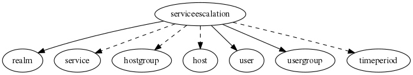

.. _resource-serviceescalation:

Service escalation (serviceescalation)
======================================

    The ``serviceescalation`` model is used to define escalated notifications for the hosts.

    See the Alignak documentation regarding the escalations to discover all the features
    and the possibilities behind this Alignak feature.
    

.. csv-table:: Properties
   :header: "Property", "Type", "Required", "Default", "Relation"

   "| :ref:`_realm <serviceescalation-_realm>`
   | *Realm*", "**objectid**", "**True**", "****", ":ref:`realm <resource-realm>`"
   "| :ref:`_sub_realm <serviceescalation-_sub_realm>`
   | *Sub-realms*", "boolean", "", "True", ""
   "| _users_delete", "objectid list", "", "", ":ref:`user <resource-user>`"
   "| _users_read", "objectid list", "", "", ":ref:`user <resource-user>`"
   "| _users_update", "objectid list", "", "", ":ref:`user <resource-user>`"
   "| :ref:`alias <serviceescalation-alias>`
   | *Alias*", "string", "", "", ""
   "| :ref:`definition_order <serviceescalation-definition_order>`
   | *Definition order*", "integer", "", "100", ""
   "| :ref:`escalation_options <serviceescalation-escalation_options>`
   | *Escalation options*", "list", "", "['w', 'c', 'x', 'r']", ""
   "| :ref:`escalation_period <serviceescalation-escalation_period>`
   | *Escalation time period*", "objectid", "", "", ":ref:`timeperiod <resource-timeperiod>`"
   "| :ref:`first_notification <serviceescalation-first_notification>`
   | *First notification count*", "integer", "", "", ""
   "| :ref:`first_notification_time <serviceescalation-first_notification_time>`
   | *First notification time*", "integer", "", "60", ""
   "| :ref:`hostgroups <serviceescalation-hostgroups>`
   | *Hosts groups*", "objectid list", "", "", ":ref:`hostgroup <resource-hostgroup>`"
   "| :ref:`hosts <serviceescalation-hosts>`
   | *Hosts*", "objectid list", "", "", ":ref:`host <resource-host>`"
   "| :ref:`imported_from <serviceescalation-imported_from>`
   | *Imported from*", "string", "", "unknown", ""
   "| :ref:`last_notification <serviceescalation-last_notification>`
   | *Last notification count*", "integer", "", "", ""
   "| :ref:`last_notification_time <serviceescalation-last_notification_time>`
   | *Last notification time*", "integer", "", "240", ""
   "| :ref:`name <serviceescalation-name>`
   | *Service escalation name*", "**string**", "**True**", "****", ""
   "| :ref:`notes <serviceescalation-notes>`
   | *Notes*", "string", "", "", ""
   "| :ref:`notification_interval <serviceescalation-notification_interval>`
   | *Notifications interval*", "integer", "", "60", ""
   "| schema_version", "integer", "", "1", ""
   "| :ref:`services <serviceescalation-services>`
   | *Services*", "objectid list", "", "", ":ref:`service <resource-service>`"
   "| :ref:`usergroups <serviceescalation-usergroups>`
   | *Escalation users groups*", "**objectid list**", "**True**", "****", ":ref:`usergroup <resource-usergroup>`"
   "| :ref:`users <serviceescalation-users>`
   | *Escalation users*", "**objectid list**", "**True**", "****", ":ref:`user <resource-user>`"
.. _serviceescalation-_realm:

``_realm``: Realm this element belongs to.

.. _serviceescalation-_sub_realm:

``_sub_realm``: Is this element visible in the sub-realms of its realm?

.. _serviceescalation-alias:

``alias``: Element friendly name used by the Web User Interface.

.. _serviceescalation-definition_order:

``definition_order``: Priority level if several elements have the same name

.. _serviceescalation-escalation_options:

``escalation_options``: List of the notifications types this escalation is concerned with. This escalation will be used only if the host is in one of the states specified in this property.

   Allowed values: [, ', w, ', ,,  , ', c, ', ,,  , ', x, ', ,,  , ', r, ', ]

.. _serviceescalation-escalation_period:

``escalation_period``: No escalation notifications will be sent-out except during this time period.

.. _serviceescalation-first_notification:

``first_notification``: Nagios legacy. Number of the first notification this escalation will be used. **Note** that this property will be deprecated in favor of the ``first_notification_time``.

.. _serviceescalation-first_notification_time:

``first_notification_time``: Duration in minutes before sending the first escalated notification.

.. _serviceescalation-hostgroups:

``hostgroups``: List of the hosts groups concerned by the escalation.

.. _serviceescalation-hosts:

``hosts``: List of the hosts concerned by the escalation.

.. _serviceescalation-imported_from:

``imported_from``: Item importation source (alignak-backend-import, ...)

.. _serviceescalation-last_notification:

``last_notification``: Nagios legacy. Number of the last notification this escalation will not be used anymore. **Note** that this property will be deprecated in favor of the ``last_notification_time``.

.. _serviceescalation-last_notification_time:

``last_notification_time``: Duration in minutes before sending the last escalated notification. Escalated notifications will be sent-out between the first_notification_time and last_notification_time period.

.. _serviceescalation-name:

``name``: Unique service escalation name

.. _serviceescalation-notes:

``notes``: Element notes. Free text to store element information.

.. _serviceescalation-notification_interval:

``notification_interval``: Number of minutes to wait before re-sending the escalated notifications if the problem is still present. If you set this value to 0, only one notification will be sent out.

.. _serviceescalation-services:

``services``: List of the services concerned by the escalation.

.. _serviceescalation-usergroups:

``usergroups``: List of the users groups concerned by this escalation.

.. _serviceescalation-users:

``users``: List of the users concerned by this escalation.

