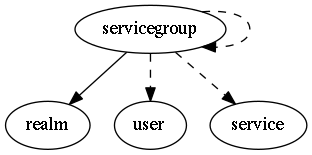

.. _resource-servicegroup:

servicegroup

===================

.. csv-table::
   :header: "Parameter", "Type", "Required", "Default", "Data relation"

   "_level", "integer", "", "0", ""
   "_users_update", "list of objectid", "", "", ":ref:`user <resource-user>`"
   "_users_read", "list of objectid", "", "", ":ref:`user <resource-user>`"
   "**name**", "**string**", "**True**", "****", ""
   "definition_order", "integer", "", "100", ""
   "_sub_realm", "boolean", "", "False", ""
   "notes", "string", "", "", ""
   "_users_delete", "list of objectid", "", "", ":ref:`user <resource-user>`"
   "_parent", "objectid", "", "", ":ref:`servicegroup <resource-servicegroup>`"
   "alias", "string", "", "", ""
   "action_url", "string", "", "", ""
   "notes_url", "string", "", "", ""
   "**_realm**", "**objectid**", "**True**", "****", ":ref:`realm <resource-realm>`"
   "services", "list of objectid", "", "[]", ":ref:`service <resource-service>`"
   "servicegroups", "list of objectid", "", "[]", ":ref:`servicegroup <resource-servicegroup>`"
   "_tree_parents", "list of objectid", "", "[]", ":ref:`servicegroup <resource-servicegroup>`"
   "imported_from", "string", "", "unknown", ""

