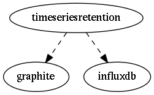

.. _resource-timeseriesretention:

timeseriesretention

===================

.. csv-table::
   :header: "Parameter", "Type", "Required", "Default", "Data relation"

   "**for_graphite**", "**boolean**", "**True**", "**False**", ""
   "**host**", "**string**", "**True**", "****", ""
   "**realm**", "**string**", "**True**", "****", ""
   "**name**", "**string**", "**True**", "****", ""
   "**service**", "**string**", "**True**", "****", ""
   "**timestamp**", "**integer**", "**True**", "****", ""
   "**for_influxdb**", "**boolean**", "**True**", "**False**", ""
   "**value**", "**integer**", "**True**", "****", ""

