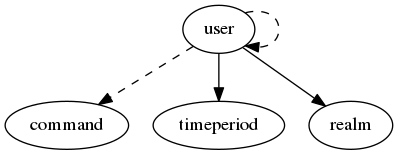

.. _resource-user:

Alignak user (user)
===================

    The ``user`` model is used to represent a user involved in the monitored system.

    It may be a "real" user that will be notified about the problems detected by Alignak, or
    a user that will use the Web User Interface to view information, or, even, a system or
    program user that will connect to the Alginak backend to provide information.
    

.. csv-table:: Properties
   :header: "Property", "Type", "Required", "Default", "Relation"

   "| :ref:`_is_template <user-_is_template>`
   | *Template*", "boolean", "", "False", ""
   "| :ref:`_realm <user-_realm>`
   | *Realm*", "**objectid**", "**True**", "****", ":ref:`realm <resource-realm>`"
   "| :ref:`_sub_realm <user-_sub_realm>`
   | *Sub-realms*", "boolean", "", "True", ""
   "| :ref:`_template_fields <user-_template_fields>`
   | *Template fields*", "list", "", "[]", ""
   "| :ref:`_templates <user-_templates>`
   | *Templates*", "objectid list", "", "[]", ":ref:`user <resource-user>`"
   "| _users_delete", "objectid list", "", "", ":ref:`user <resource-user>`"
   "| _users_read", "objectid list", "", "", ":ref:`user <resource-user>`"
   "| _users_update", "objectid list", "", "", ":ref:`user <resource-user>`"
   "| :ref:`address1 <user-address1>`
   | *Address 1*", "string", "", "", ""
   "| :ref:`address2 <user-address2>`
   | *Address 2*", "string", "", "", ""
   "| :ref:`address3 <user-address3>`
   | *Address 3*", "string", "", "", ""
   "| :ref:`address4 <user-address4>`
   | *Address 4*", "string", "", "", ""
   "| :ref:`address5 <user-address5>`
   | *Address 5*", "string", "", "", ""
   "| :ref:`address6 <user-address6>`
   | *Address 6*", "string", "", "", ""
   "| :ref:`alias <user-alias>`
   | *Alias*", "string", "", "", ""
   "| :ref:`back_role_super_admin <user-back_role_super_admin>`
   | *Super administrator*", "boolean", "", "False", ""
   "| :ref:`can_submit_commands <user-can_submit_commands>`
   | *Can submit commands*", "boolean", "", "False", ""
   "| :ref:`can_update_livestate <user-can_update_livestate>`
   | *Can update livestate*", "boolean", "", "False", ""
   "| customs
   | *Custom variables*", "dict", "", "{}", ""
   "| :ref:`definition_order <user-definition_order>`
   | *Definition order*", "integer", "", "100", ""
   "| :ref:`email <user-email>`
   | *e-mail address*", "string", "", "", ""
   "| :ref:`host_notification_commands <user-host_notification_commands>`
   | *Host notifications commands*", "objectid list", "", "", ":ref:`command <resource-command>`"
   "| :ref:`host_notification_options <user-host_notification_options>`
   | *Host notifications options*", "list", "", "['d', 'u', 'r', 'f', 's']", ""
   "| :ref:`host_notification_period <user-host_notification_period>`
   | *Host notifications period*", "**objectid**", "**True**", "****", ":ref:`timeperiod <resource-timeperiod>`"
   "| :ref:`host_notifications_enabled <user-host_notifications_enabled>`
   | *Host notifications enabled*", "boolean", "", "False", ""
   "| :ref:`imported_from <user-imported_from>`
   | *Imported from*", "string", "", "unknown", ""
   "| :ref:`is_admin <user-is_admin>`
   | *Administrator*", "boolean", "", "False", ""
   "| :ref:`min_business_impact <user-min_business_impact>`
   | *Minimum business impact*", "integer", "", "0", ""
   "| :ref:`name <user-name>`
   | *User name*", "**string**", "**True**", "****", ""
   "| :ref:`notes <user-notes>`
   | *Notes*", "string", "", "", ""
   "| :ref:`notificationways <user-notificationways>`
   | *Notification ways*", "list", "", "[]", ""
   "| :ref:`pager <user-pager>`
   | *Mobile*", "string", "", "", ""
   "| :ref:`password <user-password>`
   | *Password*", "string", "", "NOPASSWORDSET", ""
   "| schema_version", "integer", "", "2", ""
   "| :ref:`service_notification_commands <user-service_notification_commands>`
   | *Service notifications commands*", "objectid list", "", "", ":ref:`command <resource-command>`"
   "| :ref:`service_notification_options <user-service_notification_options>`
   | *Service notifications options*", "list", "", "['w', 'u', 'c', 'r', 'f', 's']", ""
   "| :ref:`service_notification_period <user-service_notification_period>`
   | *Service notifications period*", "**objectid**", "**True**", "****", ":ref:`timeperiod <resource-timeperiod>`"
   "| :ref:`service_notifications_enabled <user-service_notifications_enabled>`
   | *Service notifications enabled*", "boolean", "", "False", ""
   "| :ref:`skill_level <user-skill_level>`
   | *Level*", "integer", "", "0", ""
   "| :ref:`tags <user-tags>`
   | *Tags*", "list", "", "[]", ""
   "| :ref:`token <user-token>`
   | *Token*", "string", "", "", ""
   "| :ref:`ui_preferences <user-ui_preferences>`
   | *User preferences*", "dict", "", "{}", ""
   "| :ref:`webui_visible <user-webui_visible>`
   | *Web UI visible*", "boolean", "", "True", ""
.. _user-_is_template:

``_is_template``: Indicate if this element is a template or a real element

.. _user-_realm:

``_realm``: Realm this element belongs to.

.. _user-_sub_realm:

``_sub_realm``: Is this element visible in the sub-realms of its realm?

.. _user-_template_fields:

``_template_fields``: If this element is not a template, this field contains the list of the fields linked to the templates this element is linked to

.. _user-_templates:

``_templates``: List of templates this element is linked to.

.. _user-address1:

``address1``: User post address.

.. _user-address2:

``address2``: User post address.

.. _user-address3:

``address3``: User post address.

.. _user-address4:

``address4``: User post address.

.. _user-address5:

``address5``: User post address.

.. _user-address6:

``address6``: User post address. Note that this field may be used in the configuration files when importing data into the Alignak backend. The alignak-backend-import script will consider this field as the user's realm.

.. _user-alias:

``alias``: Element friendly name used by the Web User Interface.

.. _user-back_role_super_admin:

``back_role_super_admin``: This user is a super-administrator that is allowed to view and do anything in the Alignak backend

.. _user-can_submit_commands:

``can_submit_commands``: Used by the Web User Interface to allow the logged-in user to send commands to Alignak. This do not allow the user to edit the Alignak backend data.

.. _user-can_update_livestate:

``can_update_livestate``: This user can update the live state information of the Alignak backend. This property is used for the user that will be configured for the Alignak Broker backend module. If this attribute is not set, then the logged-in user will not be allowed to update live state information (standard Web User Interface user).

.. _user-definition_order:

``definition_order``: Priority level if several elements have the same name

.. _user-email:

``email``: User e-mail address to be used for the notifications.

.. _user-host_notification_commands:

``host_notification_commands``: List of the notifications commands used to send the notifications.

.. _user-host_notification_options:

``host_notification_options``: List of the notifications types that can be sent.

   Allowed values: [, ', d, ', ,,  , ', u, ', ,,  , ', r, ', ,,  , ', f, ', ,,  , ', s, ', ,,  , ', n, ', ]

.. _user-host_notification_period:

``host_notification_period``: Time period defining the moments this user will receive the notifications raised or an element he is attached to.

.. _user-host_notifications_enabled:

``host_notifications_enabled``: If unset, this user will never receive any notification when a problem is detected for an host/service he is linked to.

.. _user-imported_from:

``imported_from``: Item importation source (alignak-backend-import, ...)

.. _user-is_admin:

``is_admin``: Used by the Web User Interface to allow the logged-in user to update the Alignak backend data and to send commands to Alignak

.. _user-min_business_impact:

``min_business_impact``: Minimum business impact the user is concerned with. If a notification is raised for an element which BI is lower than the minimum business impact of the user, the notification will be filtered out.

.. _user-name:

``name``: Unique user name. Will be used as a login username

.. _user-notes:

``notes``: Element notes. Free text to store element information.

.. _user-notificationways:

``notificationways``: User notification ways.

.. _user-pager:

``pager``: User mobile phone to be used for the notifications.

.. _user-password:

``password``: This field is used on user's creation as the password and it is then obfuscated by the Alignak backend

.. _user-service_notification_commands:

``service_notification_commands``: List of the notifications commands used to send the notifications.

.. _user-service_notification_options:

``service_notification_options``: List of the notifications types that can be sent.

   Allowed values: [, ', w, ', ,,  , ', u, ', ,,  , ', c, ', ,,  , ', r, ', ,,  , ', f, ', ,,  , ', s, ', ,,  , ', n, ', ]

.. _user-service_notification_period:

``service_notification_period``: Time period defining the moments this user will receive the notifications raised or an element he is attached to.

.. _user-service_notifications_enabled:

``service_notifications_enabled``: If unset, this user will never receive any notification when a problem is detected for an host/service he is linked to.

.. _user-skill_level:

``skill_level``: This field is the user's skill level. It is used by the Web User Interface to display more or less advanced information. Each property in the backend data models may have its own skill level and it will be displayed it the user's skill level is greater than or equal. As default, the skill level is 0 and the property will be displayed.

.. _user-tags:

``tags``: List of tags for this element. Intended to set tags by the Web UI

.. _user-token:

``token``: This field is the user's authentication token that can be used in the REST API as a basic authentication credentials

.. _user-ui_preferences:

``ui_preferences``: User preferences that are used by the Web User Interface to manage the user preferences (eg. table filters, ...).

.. _user-webui_visible:

``webui_visible``: If not set, the Web User Interface will ignore this user.

