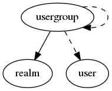

.. _resource-usergroup:

Alignak users groups (usergroup)
================================

    The ``usergroup`` model is used to group several users.

    

.. csv-table:: Properties
   :header: "Property", "Type", "Required", "Default", "Relation"

   "| :ref:`_level <usergroup-_level>`
   | *Level*", "integer", "", "0", ""
   "| :ref:`_parent <usergroup-_parent>`
   | *Parent*", "objectid", "", "", ":ref:`usergroup <resource-usergroup>`"
   "| :ref:`_realm <usergroup-_realm>`
   | *Realm*", "**objectid**", "**True**", "****", ":ref:`realm <resource-realm>`"
   "| :ref:`_sub_realm <usergroup-_sub_realm>`
   | *Sub-realms*", "boolean", "", "False", ""
   "| :ref:`_tree_parents <usergroup-_tree_parents>`
   | *Parents*", "objectid list", "", "[]", ":ref:`usergroup <resource-usergroup>`"
   "| _users_delete", "objectid list", "", "", ":ref:`user <resource-user>`"
   "| _users_read", "objectid list", "", "", ":ref:`user <resource-user>`"
   "| _users_update", "objectid list", "", "", ":ref:`user <resource-user>`"
   "| :ref:`alias <usergroup-alias>`
   | *Alias*", "string", "", "", ""
   "| :ref:`definition_order <usergroup-definition_order>`
   | *Definition order*", "integer", "", "100", ""
   "| :ref:`imported_from <usergroup-imported_from>`
   | *Imported from*", "string", "", "unknown", ""
   "| :ref:`name <usergroup-name>`
   | *Users group name*", "**string**", "**True**", "****", ""
   "| :ref:`notes <usergroup-notes>`
   | *Notes*", "string", "", "", ""
   "| :ref:`usergroups <usergroup-usergroups>`
   | *Groups*", "objectid list", "", "[]", ":ref:`usergroup <resource-usergroup>`"
   "| :ref:`users <usergroup-users>`
   | *Members*", "objectid list", "", "[]", ":ref:`user <resource-user>`"
.. _usergroup-_level:

``_level``: Level in the hierarchy

.. _usergroup-_parent:

``_parent``: Immediate parent in the hierarchy

.. _usergroup-_realm:

``_realm``: Realm this element belongs to.

.. _usergroup-_sub_realm:

``_sub_realm``: Is this element visible in the sub-realms of its realm?

.. _usergroup-_tree_parents:

``_tree_parents``: List of parents in the hierarchy

.. _usergroup-alias:

``alias``: Element friendly name used by the Web User Interface.

.. _usergroup-definition_order:

``definition_order``: Priority level if several elements have the same name

.. _usergroup-imported_from:

``imported_from``: Item importation source (alignak-backend-import, ...)

.. _usergroup-name:

``name``: Unique users group name

.. _usergroup-notes:

``notes``: Element notes. Free text to store element information.

.. _usergroup-usergroups:

``usergroups``: List of the groups of this group

.. _usergroup-users:

``users``: List of the members of this group

