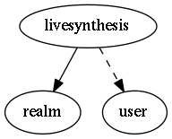

.. _resource-livesynthesis:

livesynthesis
===================

.. csv-table::
   :header: "Parameter", "Type", "Required", "Default", "Data relation"

   "services_acknowledged", "integer", "", "0", ""
   "hosts_up_soft", "integer", "", "0", ""
   "services_warning_hard", "integer", "", "0", ""
   "services_flapping", "integer", "", "0", ""
   "**_realm**", "**objectid**", "**True**", "****", ":ref:`realm <resource-realm>`"
   "hosts_down_soft", "integer", "", "0", ""
   "_users_read", "list of objectid", "", "", ":ref:`user <resource-user>`"
   "services_warning_soft", "integer", "", "0", ""
   "hosts_acknowledged", "integer", "", "0", ""
   "hosts_down_hard", "integer", "", "0", ""
   "hosts_flapping", "integer", "", "0", ""
   "services_total", "integer", "", "0", ""
   "hosts_in_downtime", "integer", "", "0", ""
   "hosts_business_impact", "integer", "", "0", ""
   "services_ok_hard", "integer", "", "0", ""
   "hosts_unreachable_hard", "integer", "", "0", ""
   "services_critical_soft", "integer", "", "0", ""
   "services_business_impact", "integer", "", "0", ""
   "hosts_unreachable_soft", "integer", "", "0", ""
   "services_critical_hard", "integer", "", "0", ""
   "hosts_up_hard", "integer", "", "0", ""
   "hosts_total", "integer", "", "0", ""
   "services_unknown_soft", "integer", "", "0", ""
   "services_ok_soft", "integer", "", "0", ""
   "services_unknown_hard", "integer", "", "0", ""
   "services_in_downtime", "integer", "", "0", ""

