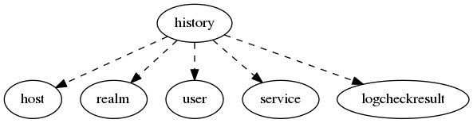

.. _resource-history:

Events log (history)
====================

    The ``history`` model is used to maintain a log of the received checks results.

    The Alignak backend stores all the checks results it receives to keep a full log of the system
    checks results.
    

.. csv-table:: Properties
   :header: "Property", "Type", "Required", "Default", "Relation"

   "| _realm", "objectid", "", "", ":ref:`realm <resource-realm>`"
   "| _sub_realm", "boolean", "", "True", ""
   "| _users_read", "objectid list", "", "", ":ref:`user <resource-user>`"
   "| :ref:`host <history-host>`
   | *Concerned host identifier*", "objectid", "", "", ":ref:`host <resource-host>`"
   "| :ref:`host_name <history-host_name>`
   | *Concerned host name*", "string", "", "", ""
   "| :ref:`logcheckresult <history-logcheckresult>`
   | *Relate log chek result (if any)*", "objectid", "", "", ":ref:`logcheckresult <resource-logcheckresult>`"
   "| message
   | *History event message*", "string", "", "", ""
   "| schema_version", "integer", "", "1", ""
   "| :ref:`service <history-service>`
   | *Concerned service identifier*", "objectid", "", "", ":ref:`service <resource-service>`"
   "| :ref:`service_name <history-service_name>`
   | *Concerned service name*", "string", "", "", ""
   "| :ref:`type <history-type>`
   | *History event type*", "**string**", "**True**", "**check.result**", ""
   "| :ref:`user <history-user>`
   | *Concerned user identifier*", "objectid", "", "", ":ref:`user <resource-user>`"
   "| :ref:`user_name <history-user_name>`
   | *Concerned user name*", "string", "", "", ""
.. _history-host:

``host``: ! Will be removed in a future version

.. _history-host_name:

``host_name``: The backend stores the host name. This allows to keep an information about the concerned host even if it has been deleted from the backend.

.. _history-logcheckresult:

``logcheckresult``: This relation is only valid if the event type is a check result

.. _history-service:

``service``: ! Will be removed in a future version

.. _history-service_name:

``service_name``: The backend stores the service name. This allows to keep an information about the concerned service even if it has been deleted from the backend.

.. _history-type:

``type``: 

   Allowed values: ['webui.comment', 'check.result', 'check.request', 'check.requested', 'ack.add', 'ack.processed', 'ack.delete', 'downtime.add', 'downtime.processed', 'downtime.delete', 'monitoring.external_command', 'monitoring.timeperiod_transition', 'monitoring.alert', 'monitoring.event_handler', 'monitoring.flapping_start', 'monitoring.flapping_stop', 'monitoring.downtime_start', 'monitoring.downtime_cancelled', 'monitoring.downtime_end', 'monitoring.acknowledge', 'monitoring.notification']

.. _history-user:

``user``: ! Will be removed in a future version

.. _history-user_name:

``user_name``: The backend stores the user name. This allows to keep an information about the concerned user even if it has been deleted from the backend.

