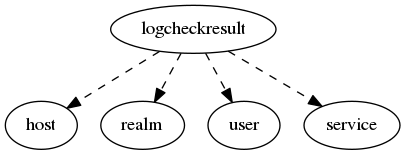

.. _resource-logcheckresult:

Check result log (logcheckresult)
=================================

    The ``logcheckresult`` model is used to maintain a log of the received checks results.

    The Alignak backend stores all the checks results it receives to keep a full log of the system
    checks results.
    

.. csv-table:: Properties
   :header: "Property", "Type", "Required", "Default", "Relation"

   "| :ref:`_realm <logcheckresult-_realm>`
   | *Realm*", "objectid", "", "", ":ref:`realm <resource-realm>`"
   "| :ref:`_sub_realm <logcheckresult-_sub_realm>`
   | *Sub-realms*", "boolean", "", "True", ""
   "| _users_read", "objectid list", "", "", ":ref:`user <resource-user>`"
   "| acknowledged
   | *Acknowledged*", "boolean", "", "False", ""
   "| acknowledgement_type
   | *Acknowledgement type*", "integer", "", "1", ""
   "| current_attempt
   | *Current attempt number*", "integer", "", "0", ""
   "| downtimed
   | *Downtimed*", "boolean", "", "False", ""
   "| execution_time
   | *Execution time*", "float", "", "0.0", ""
   "| host
   | *Concerned host identifier*", "objectid", "", "", ":ref:`host <resource-host>`"
   "| :ref:`host_name <logcheckresult-host_name>`
   | *Host name*", "string", "", "", ""
   "| last_check
   | *Check timestamp*", "integer", "", "0", ""
   "| :ref:`last_hard_state_changed <logcheckresult-last_hard_state_changed>`
   | *Last time hard state changed*", "integer", "", "0", ""
   "| :ref:`last_state <logcheckresult-last_state>`
   | *Last state*", "string", "", "OK", ""
   "| :ref:`last_state_changed <logcheckresult-last_state_changed>`
   | *Last state changed*", "integer", "", "0", ""
   "| last_state_id
   | *Last state identifier*", "integer", "", "0", ""
   "| :ref:`last_state_type <logcheckresult-last_state_type>`
   | *Last state type*", "**string**", "**True**", "****", ""
   "| :ref:`last_time_0 <logcheckresult-last_time_0>`
   | *Last time up/ok*", "integer", "", "0", ""
   "| :ref:`last_time_1 <logcheckresult-last_time_1>`
   | *Last time Down/Warning*", "integer", "", "0", ""
   "| :ref:`last_time_2 <logcheckresult-last_time_2>`
   | *Last time critical*", "integer", "", "0", ""
   "| :ref:`last_time_3 <logcheckresult-last_time_3>`
   | *Last time unknown*", "integer", "", "0", ""
   "| :ref:`last_time_4 <logcheckresult-last_time_4>`
   | *Last time unreachable*", "integer", "", "0", ""
   "| latency
   | *Latency*", "float", "", "0.0", ""
   "| long_output
   | *Long output*", "string", "", "", ""
   "| output
   | *Output*", "string", "", "", ""
   "| passive_check
   | *Passive check*", "boolean", "", "False", ""
   "| perf_data
   | *Performance data*", "string", "", "", ""
   "| schema_version", "integer", "", "3", ""
   "| :ref:`service <logcheckresult-service>`
   | *Concerned service identifier*", "objectid", "", "", ":ref:`service <resource-service>`"
   "| :ref:`service_name <logcheckresult-service_name>`
   | *Service name*", "string", "", "", ""
   "| :ref:`state <logcheckresult-state>`
   | *State*", "**string**", "**True**", "****", ""
   "| :ref:`state_changed <logcheckresult-state_changed>`
   | *State changed*", "boolean", "", "False", ""
   "| state_id
   | *State identifier*", "integer", "", "0", ""
   "| :ref:`state_type <logcheckresult-state_type>`
   | *State type*", "**string**", "**True**", "****", ""
.. _logcheckresult-_realm:

``_realm``: Realm this element belongs to.

.. _logcheckresult-_sub_realm:

``_sub_realm``: Is this element visible in the sub-realms of its realm?

.. _logcheckresult-host_name:

``host_name``: The backend stores the host name. This allows to keep an information about the concerned host even if it has been deleted from the backend.

.. _logcheckresult-last_hard_state_changed:

``last_hard_state_changed``: Last time this element hard state has changed.

.. _logcheckresult-last_state:

``last_state``: 

   Allowed values: ['OK', 'WARNING', 'CRITICAL', 'UNKNOWN', 'UP', 'DOWN', 'UNREACHABLE']

.. _logcheckresult-last_state_changed:

``last_state_changed``: Last time the state changed

.. _logcheckresult-last_state_type:

``last_state_type``: 

   Allowed values: ['HARD', 'SOFT']

.. _logcheckresult-last_time_0:

``last_time_0``: Last time this element was Up/Ok.

.. _logcheckresult-last_time_1:

``last_time_1``: Last time this element was Down/Warning.

.. _logcheckresult-last_time_2:

``last_time_2``: Last time this element was Critical.

.. _logcheckresult-last_time_3:

``last_time_3``: Last time this element was Unknown.

.. _logcheckresult-last_time_4:

``last_time_4``: Last time this element was Unreachable.

.. _logcheckresult-service:

``service``: If not set, this check result is an host check

.. _logcheckresult-service_name:

``service_name``: The backend stores the service name. This allows to keep an information about the concerned service even if it has been deleted from the backend.

.. _logcheckresult-state:

``state``: 

   Allowed values: ['UP', 'DOWN', 'UNREACHABLE', 'OK', 'WARNING', 'CRITICAL', 'UNKNOWN']

.. _logcheckresult-state_changed:

``state_changed``: The state has changed with the last check?

.. _logcheckresult-state_type:

``state_type``: 

   Allowed values: ['HARD', 'SOFT']

