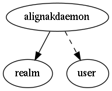

.. _resource-alignakdaemon:

Alignak daemons live state (alignakdaemon)
==========================================

    The ``alignakdaemon`` model is maintained by Alignak to provide the live state of
    the Alignak daemons.

    For hosts and services, the live synthesis stores values computed from the real
    live state, each time an element state is updated:
    - a counter containing the number of host/service in each state
    - a counter containing the number of host/service acknowledged
    - a counter containing the number of host/service in downtime
    - a counter containing the number of host/service flapping
    - the maximum business impact of the host/service in the state
    

.. csv-table:: Properties
   :header: "Property", "Type", "Required", "Default", "Relation"

   "| :ref:`_realm <alignakdaemon-_realm>`
   | *Realm*", "**objectid**", "**True**", "****", ":ref:`realm <resource-realm>`"
   "| :ref:`_sub_realm <alignakdaemon-_sub_realm>`
   | *Sub-realms*", "boolean", "", "True", ""
   "| _users_delete", "objectid list", "", "", ":ref:`user <resource-user>`"
   "| _users_read", "objectid list", "", "", ":ref:`user <resource-user>`"
   "| _users_update", "objectid list", "", "", ":ref:`user <resource-user>`"
   "| address
   | *Address*", "**string**", "**True**", "****", ""
   "| :ref:`alive <alignakdaemon-alive>`
   | *Alive*", "**boolean**", "**True**", "**False**", ""
   "| :ref:`last_check <alignakdaemon-last_check>`
   | *Last check*", "**integer**", "**True**", "****", ""
   "| :ref:`name <alignakdaemon-name>`
   | *Daemon name*", "**string**", "**True**", "****", ""
   "| :ref:`passive <alignakdaemon-passive>`
   | *Passive*", "**boolean**", "**True**", "**False**", ""
   "| port
   | *Port*", "**integer**", "**True**", "****", ""
   "| :ref:`reachable <alignakdaemon-reachable>`
   | *Reachable*", "**boolean**", "**True**", "**False**", ""
   "| schema_version", "integer", "", "1", ""
   "| :ref:`spare <alignakdaemon-spare>`
   | *Spare*", "**boolean**", "**True**", "**False**", ""
   "| :ref:`type <alignakdaemon-type>`
   | *Type*", "**string**", "**True**", "****", ""
.. _alignakdaemon-_realm:

``_realm``: Realm this element belongs to.

.. _alignakdaemon-_sub_realm:

``_sub_realm``: Is this element visible in the sub-realms of its realm?

.. _alignakdaemon-alive:

``alive``: The daemon is alive

.. _alignakdaemon-last_check:

``last_check``: Last time the daemon was checked

.. _alignakdaemon-name:

``name``: Unique daemon name

.. _alignakdaemon-passive:

``passive``: The daemon is a passive daemon

.. _alignakdaemon-reachable:

``reachable``: The daemon is reachable

.. _alignakdaemon-spare:

``spare``: The daemon is a spare daemon

.. _alignakdaemon-type:

``type``: Daemon type: "arbiter", "scheduler", "poller", "broker", "reactionner", "receiver"

   Allowed values: [, ', a, r, b, i, t, e, r, ', ,,  , ', s, c, h, e, d, u, l, e, r, ', ,,  , ', p, o, l, l, e, r, ', ,,  , ', b, r, o, k, e, r, ', ,,  , ', r, e, a, c, t, i, o, n, n, e, r, ', ,,  , ', r, e, c, e, i, v, e, r, ', ]

