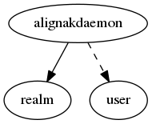

.. _resource-alignakdaemon:

Alignak daemons live state (alignakdaemon)
==========================================

    The ``alignakdaemon`` model is maintained by Alignak to provide the live state of
    the Alignak daemons.

    Alignak arbiter daemon is polling all the running daemons regularly and it stores
    the information about this polling in the Alignak backend.
    

.. csv-table:: Properties
   :header: "Property", "Type", "Required", "Default", "Relation"

   "| :ref:`_realm <alignakdaemon-_realm>`
   | *Realm*", "**objectid**", "**True**", "****", ":ref:`realm <resource-realm>`"
   "| :ref:`_sub_realm <alignakdaemon-_sub_realm>`
   | *Sub-realms*", "boolean", "", "False", ""
   "| _users_delete", "objectid list", "", "", ":ref:`user <resource-user>`"
   "| _users_read", "objectid list", "", "", ":ref:`user <resource-user>`"
   "| _users_update", "objectid list", "", "", ":ref:`user <resource-user>`"
   "| address
   | *Address*", "**string**", "**True**", "****", ""
   "| :ref:`alive <alignakdaemon-alive>`
   | *Alive*", "**boolean**", "**True**", "**False**", ""
   "| :ref:`last_check <alignakdaemon-last_check>`
   | *Last check*", "**integer**", "**True**", "****", ""
   "| :ref:`name <alignakdaemon-name>`
   | *Daemon name*", "**string**", "**True**", "****", ""
   "| :ref:`passive <alignakdaemon-passive>`
   | *Passive*", "**boolean**", "**True**", "**False**", ""
   "| port
   | *Port*", "**integer**", "**True**", "****", ""
   "| :ref:`reachable <alignakdaemon-reachable>`
   | *Reachable*", "**boolean**", "**True**", "**False**", ""
   "| :ref:`spare <alignakdaemon-spare>`
   | *Spare*", "**boolean**", "**True**", "**False**", ""
   "| :ref:`type <alignakdaemon-type>`
   | *Type*", "**string**", "**True**", "****", ""
.. _alignakdaemon-_realm:

``_realm``: Realm this element belongs to.

.. _alignakdaemon-_sub_realm:

``_sub_realm``: Is this element visible in the sub-realms of its realm?

.. _alignakdaemon-alive:

``alive``: The daemon is alive

.. _alignakdaemon-last_check:

``last_check``: Last time the daemon was checked

.. _alignakdaemon-name:

``name``: Unique daemon name

.. _alignakdaemon-passive:

``passive``: The daemon is a passive daemon

.. _alignakdaemon-reachable:

``reachable``: The daemon is reachable

.. _alignakdaemon-spare:

``spare``: The daemon is a spare daemon

.. _alignakdaemon-type:

``type``: Daemon type: 'arbiter', 'scheduler', 'poller', 'broker', 'reactionner', 'receiver'

   Allowed values: arbiter, scheduler, poller, broker, reactionner, receiver

