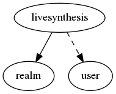

.. _resource-livesynthesis:

Alignak live state synthesis (livesynthesis)
============================================

    The ``livesynthesis`` model is maintained by the Alignak to get an easy overview of
    the monitored system state.

    For hosts and services, the live synthesis stores values computed from the real
    live state, each time an element state is updated:
    - a counter containing the number of host/service in each state
    - a counter containing the number of host/service acknowledged
    - a counter containing the number of host/service in downtime
    - a counter containing the number of host/service flapping
    - the maximum business impact of the host/service in the state
    

.. csv-table:: Properties
   :header: "Property", "Type", "Required", "Default", "Relation"

   "| :ref:`_realm <livesynthesis-_realm>`
   | *Realm*", "**objectid**", "**True**", "****", ":ref:`realm <resource-realm>`"
   "| :ref:`_sub_realm <livesynthesis-_sub_realm>`
   | *Sub-realms*", "boolean", "", "True", ""
   "| _users_read", "objectid list", "", "", ":ref:`user <resource-user>`"
   "| hosts_acknowledged
   | *Hosts ackowledged*", "integer", "", "0", ""
   "| hosts_business_impact
   | *Hosts business impact*", "integer", "", "0", ""
   "| hosts_down_hard
   | *Hosts Down hard*", "integer", "", "0", ""
   "| hosts_down_soft
   | *Hosts Down soft*", "integer", "", "0", ""
   "| hosts_flapping
   | *Hosts flapping*", "integer", "", "0", ""
   "| hosts_in_downtime
   | *Hosts in downtime*", "integer", "", "0", ""
   "| hosts_total
   | *Hosts count*", "integer", "", "0", ""
   "| hosts_unreachable_hard
   | *Hosts Unreachable hard*", "integer", "", "0", ""
   "| hosts_unreachable_soft
   | *Hosts Unreachable soft*", "integer", "", "0", ""
   "| hosts_up_hard
   | *Hosts Up hard*", "integer", "", "0", ""
   "| hosts_up_soft
   | *Hosts Up soft*", "integer", "", "0", ""
   "| services_acknowledged
   | *Services acknowledged*", "integer", "", "0", ""
   "| services_business_impact
   | *Services business impact*", "integer", "", "0", ""
   "| services_critical_hard
   | *Services Critical hard*", "integer", "", "0", ""
   "| services_critical_soft
   | *Services Criticl soft*", "integer", "", "0", ""
   "| services_flapping
   | *Services flapping*", "integer", "", "0", ""
   "| services_in_downtime
   | *Services in downtime*", "integer", "", "0", ""
   "| services_ok_hard
   | *Services Ok hard*", "integer", "", "0", ""
   "| services_ok_soft
   | *Services Ok soft*", "integer", "", "0", ""
   "| services_total
   | *Services count*", "integer", "", "0", ""
   "| services_unknown_hard
   | *Services Unknown hard*", "integer", "", "0", ""
   "| services_unknown_soft
   | *Services Unknown soft*", "integer", "", "0", ""
   "| services_unreachable_hard
   | *Services Unreachable hard*", "integer", "", "0", ""
   "| services_unreachable_soft
   | *Services Unreachable soft*", "integer", "", "0", ""
   "| services_warning_hard
   | *Services Warning hard*", "integer", "", "0", ""
   "| services_warning_soft
   | *Services Warning soft*", "integer", "", "0", ""
.. _livesynthesis-_realm:

``_realm``: Realm this element belongs to.

.. _livesynthesis-_sub_realm:

``_sub_realm``: Is this element visible in the sub-realms of its realm?

