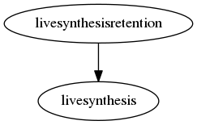

.. _resource-livesynthesisretention:

Alignak live state history (livesynthesisretention)
===================================================

    The ``livesynthesisretention`` model is a cache used internally by the backend to store the
    last computed live synthesis information. If the live synthesis history is configured,
    a count of ``SCHEDULER_LIVESYNTHESIS_HISTORY`` live synthesis elements will be store in the
    live synthesis retention data model.
    

.. csv-table:: Properties
   :header: "Property", "Type", "Required", "Default", "Relation"

   "| hosts_acknowledged
   | *Hosts ackowledged*", "integer", "", "0", ""
   "| hosts_down_hard
   | *Hosts Down hard*", "integer", "", "0", ""
   "| hosts_down_soft
   | *Hosts Down soft*", "integer", "", "0", ""
   "| hosts_flapping
   | *Hosts flapping*", "integer", "", "0", ""
   "| hosts_in_downtime
   | *Hosts in downtime*", "integer", "", "0", ""
   "| hosts_not_monitored
   | *Hosts not monitored*", "integer", "", "0", ""
   "| hosts_total
   | *Hosts count*", "integer", "", "0", ""
   "| hosts_unreachable_hard
   | *Hosts Unreachable hard*", "integer", "", "0", ""
   "| hosts_unreachable_soft
   | *Hosts Unreachable soft*", "integer", "", "0", ""
   "| hosts_up_hard
   | *Hosts Up hard*", "integer", "", "0", ""
   "| hosts_up_soft
   | *Hosts Up soft*", "integer", "", "0", ""
   "| livesynthesis", "**objectid**", "**True**", "****", ":ref:`livesynthesis <resource-livesynthesis>`"
   "| schema_version", "integer", "", "2", ""
   "| services_acknowledged
   | *Services acknowledged*", "integer", "", "0", ""
   "| services_critical_hard
   | *Services Critical hard*", "integer", "", "0", ""
   "| services_critical_soft
   | *Services Criticl soft*", "integer", "", "0", ""
   "| services_flapping
   | *Services flapping*", "integer", "", "0", ""
   "| services_in_downtime
   | *Services in downtime*", "integer", "", "0", ""
   "| services_not_monitored
   | *Services not monitored*", "integer", "", "0", ""
   "| services_ok_hard
   | *Services Ok hard*", "integer", "", "0", ""
   "| services_ok_soft
   | *Services Ok soft*", "integer", "", "0", ""
   "| services_total
   | *Services count*", "integer", "", "0", ""
   "| services_unknown_hard
   | *Services Unknown hard*", "integer", "", "0", ""
   "| services_unknown_soft
   | *Services Unknown soft*", "integer", "", "0", ""
   "| services_unreachable_hard
   | *Services Unreachable hard*", "integer", "", "0", ""
   "| services_unreachable_soft
   | *Services Unreachable soft*", "integer", "", "0", ""
   "| services_warning_hard
   | *Services Warning hard*", "integer", "", "0", ""
   "| services_warning_soft
   | *Services Warning soft*", "integer", "", "0", ""

