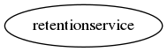

.. _resource-retentionservice:

Service data retention (retentionservice)
=========================================

    The ``retentionservice`` model is used by the Alignak backend scheduler module for the
    Alignak retention feature.
    

.. csv-table:: Properties
   :header: "Property", "Type", "Required", "Default", "Relation"

   "| service", "list", "", "", ""

