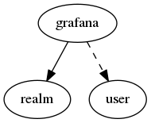

.. _resource-grafana:

Grafana connection (grafana)
============================

    The ``grafana`` model contains information to manage Grafana panels for the monitored
    system performance data.

    The Alignak backend will use those information to create/update Grafana panels for each
    managed timeseries. A Grafana dashboard is created automatically for each host in the
    monitored system. A panel is created automatically in this dashboard for each metric
    of the concerned host.
    

.. csv-table:: Properties
   :header: "Property", "Type", "Required", "Default", "Relation"

   "| :ref:`_realm <grafana-_realm>`
   | *Realm*", "**objectid**", "**True**", "****", ":ref:`realm <resource-realm>`"
   "| :ref:`_sub_realm <grafana-_sub_realm>`
   | *Sub-realms*", "boolean", "", "False", ""
   "| _users_delete", "objectid list", "", "", ":ref:`user <resource-user>`"
   "| _users_read", "objectid list", "", "", ":ref:`user <resource-user>`"
   "| _users_update", "objectid list", "", "", ":ref:`user <resource-user>`"
   "| address
   | *Server address*", "**string**", "**True**", "****", ""
   "| apikey", "**string**", "**True**", "****", ""
   "| :ref:`name <grafana-name>`
   | *Grafana connection name*", "**string**", "**True**", "****", ""
   "| port
   | *Server port*", "integer", "", "3000", ""
   "| :ref:`refresh <grafana-refresh>`
   | *Dashboard refresh period*", "string", "", "1m", ""
   "| :ref:`ssl <grafana-ssl>`
   | *SSL*", "boolean", "", "False", ""
   "| :ref:`timezone <grafana-timezone>`
   | *Grafana API key*", "string", "", "browser", ""
.. _grafana-_realm:

``_realm``: Realm this element belongs to.

.. _grafana-_sub_realm:

``_sub_realm``: Is this element visible in the sub-realms of its realm?

.. _grafana-name:

``name``: Unique Grafana connection name

.. _grafana-refresh:

``refresh``: The default Grafana dashboard refresh time.

.. _grafana-ssl:

``ssl``: Set this property if your Grafana requires SSL connection.

.. _grafana-timezone:

``timezone``: This API key is defined in the Grafana administration Web interface and it must have administrator rights in your Grafana organization.

