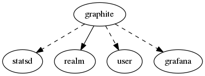

.. _resource-graphite:

Graphite connection (graphite)
==============================

    The ``graphite`` model contains information to provide the monitored system performance
    data to Carbon/Graphite.

    The Alignak backend will use those information to connect to a Carbon daemon and send the
    timeseries data. If you are using a StatsD daemon as a front-end of the Carbon daemon
    create a relation with a StatsD data model instance. To make the Alignak backend create
    some Grafana panels for the metrics sent to Graphite create a relation with a Grafana
    data model instance.
    

.. csv-table:: Properties
   :header: "Property", "Type", "Required", "Default", "Relation"

   "| :ref:`_realm <graphite-_realm>`
   | *Realm*", "**objectid**", "**True**", "****", ":ref:`realm <resource-realm>`"
   "| :ref:`_sub_realm <graphite-_sub_realm>`
   | *Sub-realms*", "boolean", "", "False", ""
   "| _users_delete", "objectid list", "", "", ":ref:`user <resource-user>`"
   "| _users_read", "objectid list", "", "", ":ref:`user <resource-user>`"
   "| _users_update", "objectid list", "", "", ":ref:`user <resource-user>`"
   "| carbon_address
   | *Carbon daemon address*", "**string**", "**True**", "****", ""
   "| carbon_port
   | *Carbon daemon port*", "integer", "", "2004", ""
   "| :ref:`grafana <graphite-grafana>`
   | *Grafana relation*", "objectid", "", "None", ":ref:`grafana <resource-grafana>`"
   "| graphite_address
   | *Graphite address*", "**string**", "**True**", "****", ""
   "| graphite_port
   | *Graphite port*", "integer", "", "8080", ""
   "| :ref:`name <graphite-name>`
   | *Graphite connection name*", "**string**", "**True**", "****", ""
   "| :ref:`prefix <graphite-prefix>`
   | *Metrics prefix*", "string", "", "", ""
   "| :ref:`statsd <graphite-statsd>`
   | *StatsD relation*", "objectid", "", "None", ":ref:`statsd <resource-statsd>`"
.. _graphite-_realm:

``_realm``: Realm this element belongs to.

.. _graphite-_sub_realm:

``_sub_realm``: Is this element visible in the sub-realms of its realm?

.. _graphite-grafana:

``grafana``: If set, the Alignak backend will use this Grafana relation for the metrics sent to the Influx DB. It will create/update the Grafana panels accordindgly.

.. _graphite-name:

``name``: Unique Graphite connection name

.. _graphite-prefix:

``prefix``: Prefix that will be prepended to the metrics sent to this TS DB.

.. _graphite-statsd:

``statsd``: If set, the Alignak backend will use this StatsD relation for the metrics sent to the Influx DB.

