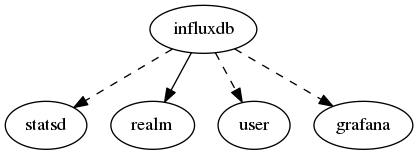

.. _resource-influxdb:

InfluxDB connection (influxdb)
==============================

    The ``influxdb`` model contains information to provide the monitored system performance
    data to InfluxDB.

    The Alignak backend will use those information to connect to an Influx DB and send the
    timeseries data. If you are using a StatsD daemon as a front-end of the InfluxDB
    create a relation with a StatsD data model instance. To make the Alignak backend
    create some Grafana panels for the metrics sent to Graphite create a relation with
    a Grafana data model instance.
    

.. csv-table:: Properties
   :header: "Property", "Type", "Required", "Default", "Relation"

   "| :ref:`_realm <influxdb-_realm>`
   | *Realm*", "**objectid**", "**True**", "****", ":ref:`realm <resource-realm>`"
   "| :ref:`_sub_realm <influxdb-_sub_realm>`
   | *Sub-realms*", "boolean", "", "True", ""
   "| _users_delete", "objectid list", "", "", ":ref:`user <resource-user>`"
   "| _users_read", "objectid list", "", "", ":ref:`user <resource-user>`"
   "| _users_update", "objectid list", "", "", ":ref:`user <resource-user>`"
   "| address
   | *Server address*", "**string**", "**True**", "****", ""
   "| database
   | *Database name*", "**string**", "**True**", "**alignak**", ""
   "| :ref:`grafana <influxdb-grafana>`
   | *Grafana relation*", "objectid", "", "None", ":ref:`grafana <resource-grafana>`"
   "| login
   | *Database login username*", "**string**", "**True**", "****", ""
   "| :ref:`name <influxdb-name>`
   | *Influx connection name*", "**string**", "**True**", "****", ""
   "| password
   | *Database login password*", "**string**", "**True**", "****", ""
   "| port
   | *Server port*", "integer", "", "8086", ""
   "| :ref:`prefix <influxdb-prefix>`
   | *Metrics prefix*", "string", "", "", ""
   "| schema_version", "integer", "", "1", ""
   "| :ref:`statsd <influxdb-statsd>`
   | *StatsD relation*", "objectid", "", "None", ":ref:`statsd <resource-statsd>`"
.. _influxdb-_realm:

``_realm``: Realm this element belongs to.

.. _influxdb-_sub_realm:

``_sub_realm``: Is this element visible in the sub-realms of its realm?

.. _influxdb-grafana:

``grafana``: If set, the Alignak backend will use this Grafana relation for the metrics sent to the Influx DB. It will create/update the Grafana panels accordindgly.

.. _influxdb-name:

``name``: Unique InfuxDB connection name

.. _influxdb-prefix:

``prefix``: Prefix that will be prepended to the metrics sent to this TS DB.

.. _influxdb-statsd:

``statsd``: If set, the Alignak backend will use this StatsD relation for the metrics sent to the Influx DB.

