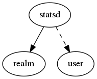

.. _resource-statsd:

StatsD connection (statsd)
==========================

    The ``statsd`` model contains information to provide the monitored system performance
    data to StatsD.

    The Alignak backend will use those information to connect to a StatsD daemon and send the
    timeseries data. StatsD may be used as a front-end to Graphite or InfluxDB thus an
    instance of this data model may be related to a Graphite or InfluxDB instance.
    

.. csv-table:: Properties
   :header: "Property", "Type", "Required", "Default", "Relation"

   "| :ref:`_realm <statsd-_realm>`
   | *Realm*", "**objectid**", "**True**", "****", ":ref:`realm <resource-realm>`"
   "| :ref:`_sub_realm <statsd-_sub_realm>`
   | *Sub-realms*", "boolean", "", "True", ""
   "| _users_delete", "objectid list", "", "", ":ref:`user <resource-user>`"
   "| _users_read", "objectid list", "", "", ":ref:`user <resource-user>`"
   "| _users_update", "objectid list", "", "", ":ref:`user <resource-user>`"
   "| address
   | *Server address*", "**string**", "**True**", "****", ""
   "| :ref:`name <statsd-name>`
   | *StatsD connection name*", "**string**", "**True**", "****", ""
   "| port
   | *Server port*", "integer", "", "8125", ""
   "| :ref:`prefix <statsd-prefix>`
   | *Metrics prefix*", "string", "", "", ""
.. _statsd-_realm:

``_realm``: Realm this element belongs to.

.. _statsd-_sub_realm:

``_sub_realm``: Is this element visible in the sub-realms of its realm?

.. _statsd-name:

``name``: Unique StatsD connection name

.. _statsd-prefix:

``prefix``: Prefix that is configured in the StatsD server (if any).

