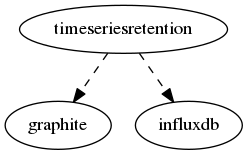

.. _resource-timeseriesretention:

TS cache (timeseriesretention)
==============================

    The ``timeseriesretention`` model is a cache used internally by the backend to store the
    data that could not be sent to Graphite / Influx DB because of a temporarily missing
    connection.
    

.. csv-table:: Properties
   :header: "Property", "Type", "Required", "Default", "Relation"

   "| graphite
   | *Graphite relation*", "objectid", "", "None", ":ref:`graphite <resource-graphite>`"
   "| host
   | *Stored metric host*", "**string**", "**True**", "****", ""
   "| influxdb
   | *InfluxDB relation*", "objectid", "", "None", ":ref:`influxdb <resource-influxdb>`"
   "| name
   | *Stored metric name*", "**string**", "**True**", "****", ""
   "| realm
   | *Stored metric host/service realm*", "**string**", "**True**", "****", ""
   "| schema_version", "integer", "", "1", ""
   "| service
   | *Stored metric service*", "**string**", "**True**", "****", ""
   "| timestamp
   | *Stored metric timestamp*", "**integer**", "**True**", "****", ""
   "| uom
   | *Stored metric unit of measure*", "**string**", "**True**", "****", ""
   "| value
   | *Stored metric value*", "**string**", "**True**", "****", ""

