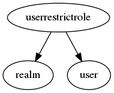

.. _resource-userrestrictrole:

User role restriction (userrestrictrole)
========================================

    The ``userrestrictrole`` model is an internal data model used to define the CRUD
    rights for an Alignak backend user.

    This allows to define, for a user and a given realm, the create, read, update, and
    delete rights on each backend endpoint.
    

.. csv-table:: Properties
   :header: "Property", "Type", "Required", "Default", "Relation"

   "| :ref:`crud <userrestrictrole-crud>`
   | *Right*", "list", "", "['read']", ""
   "| realm
   | *Concerned realm*", "**objectid**", "**True**", "****", ":ref:`realm <resource-realm>`"
   "| :ref:`resource <userrestrictrole-resource>`
   | *Concerned resource*", "string", "", "*", ""
   "| :ref:`sub_realm <userrestrictrole-sub_realm>`
   | *Sub-realms*", "boolean", "", "False", ""
   "| user
   | *Concerned user*", "**objectid**", "**True**", "****", ":ref:`user <resource-user>`"
.. _userrestrictrole-crud:

``crud``: User's right for the concerned resource in the concerned realm. Use ``*`` if all resources are concerned.

   Allowed values: [, ', c, r, e, a, t, e, ', ,,  , ', r, e, a, d, ', ,,  , ', u, p, d, a, t, e, ', ,,  , ', d, e, l, e, t, e, ', ,,  , ', c, u, s, t, o, m, ', ]

.. _userrestrictrole-resource:

``resource``: Resource concerned with the right

   Allowed values: [, ', *, ', ,,  , ', a, c, t, i, o, n, a, c, k, n, o, w, l, e, d, g, e, ', ,,  , ', a, c, t, i, o, n, d, o, w, n, t, i, m, e, ', ,,  , ', a, c, t, i, o, n, f, o, r, c, e, c, h, e, c, k, ', ,,  , ', a, l, i, g, n, a, k, ', ,,  , ', a, l, i, g, n, a, k, d, a, e, m, o, n, ', ,,  , ', r, e, a, l, m, ', ,,  , ', c, o, m, m, a, n, d, ', ,,  , ', t, i, m, e, p, e, r, i, o, d, ', ,,  , ', u, s, e, r, ', ,,  , ', u, s, e, r, g, r, o, u, p, ', ,,  , ', u, s, e, r, r, e, s, t, r, i, c, t, r, o, l, e, ', ,,  , ', h, o, s, t, ', ,,  , ', h, o, s, t, g, r, o, u, p, ', ,,  , ', h, o, s, t, d, e, p, e, n, d, e, n, c, y, ', ,,  , ', h, o, s, t, e, s, c, a, l, a, t, i, o, n, ', ,,  , ', s, e, r, v, i, c, e, ', ,,  , ', s, e, r, v, i, c, e, g, r, o, u, p, ', ,,  , ', s, e, r, v, i, c, e, d, e, p, e, n, d, e, n, c, y, ', ,,  , ', s, e, r, v, i, c, e, e, s, c, a, l, a, t, i, o, n, ', ,,  , ', g, r, a, f, a, n, a, ', ,,  , ', g, r, a, p, h, i, t, e, ', ,,  , ', i, n, f, l, u, x, d, b, ', ,,  , ', s, t, a, t, s, d, ', ,,  , ', t, i, m, e, s, e, r, i, e, s, r, e, t, e, n, t, i, o, n, ', ,,  , ', l, i, v, e, s, y, n, t, h, e, s, i, s, ', ,,  , ', l, i, v, e, s, y, n, t, h, e, s, i, s, r, e, t, e, n, t, i, o, n, ', ,,  , ', l, o, g, c, h, e, c, k, r, e, s, u, l, t, ', ,,  , ', h, i, s, t, o, r, y, ', ]

.. _userrestrictrole-sub_realm:

``sub_realm``: Is this right applicable to the sub-realms of the realm?

